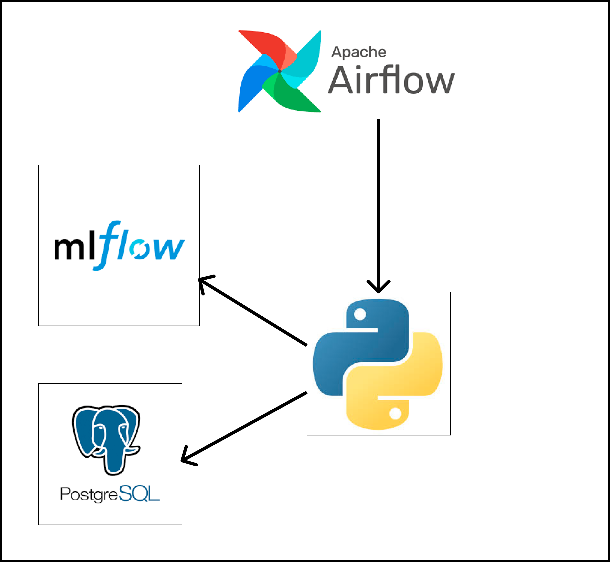
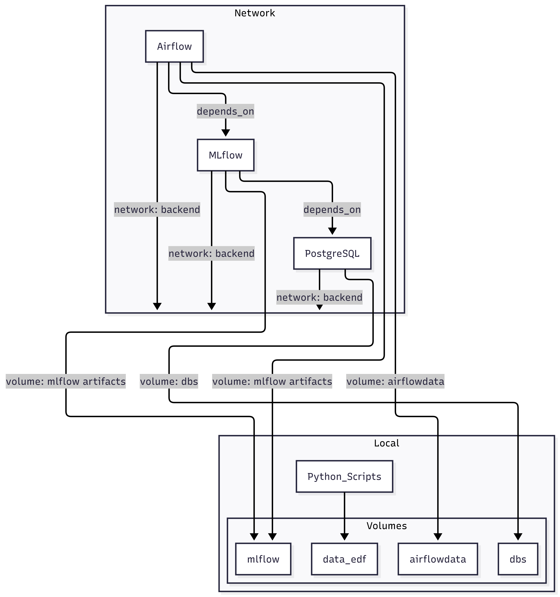
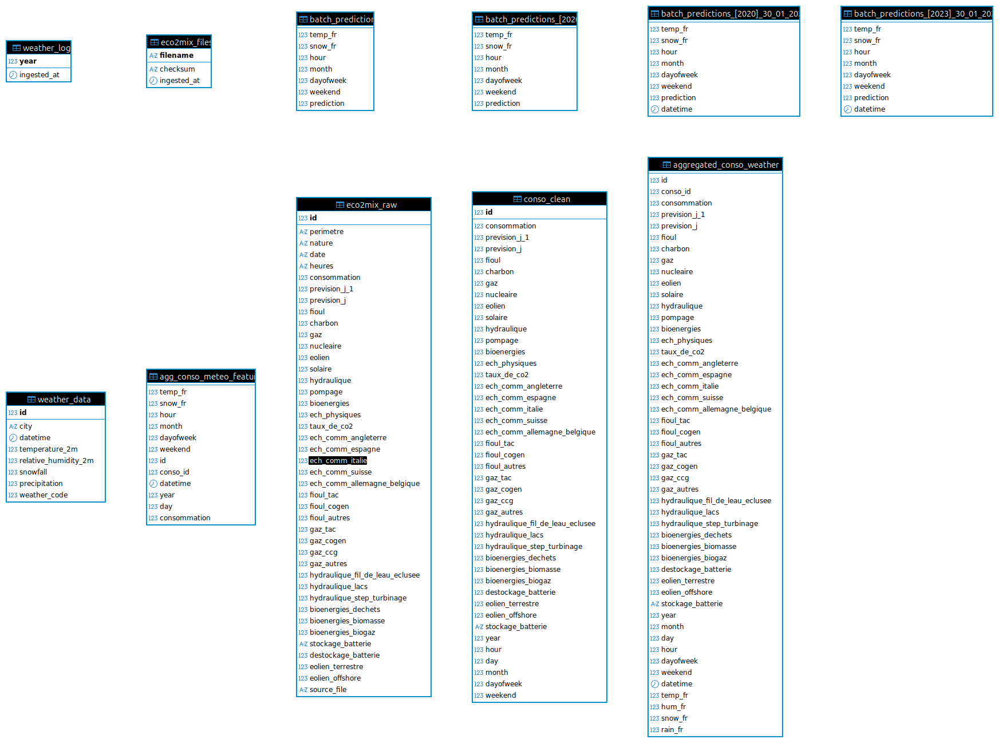
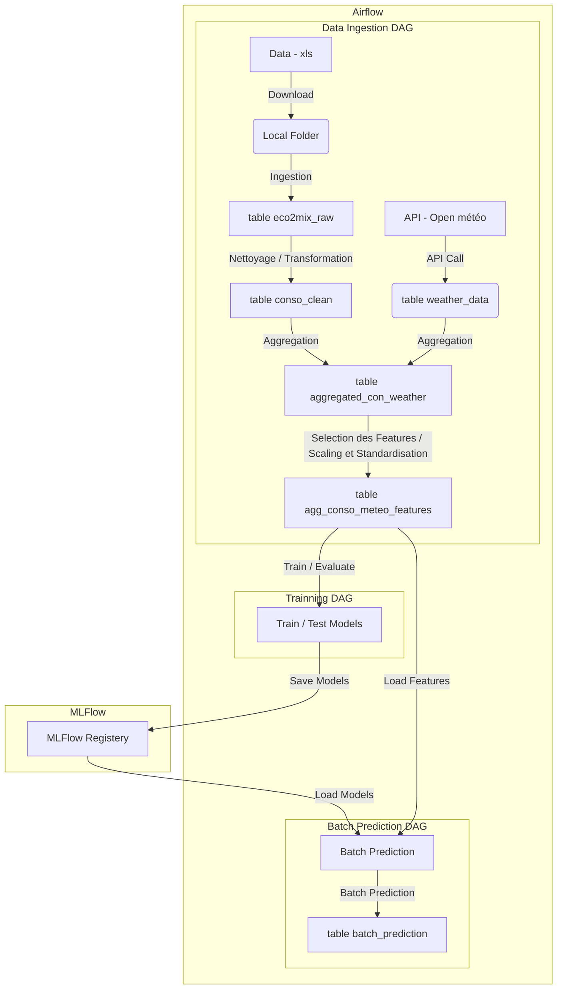

# EDF MSPR3 - Gestion de la consommation énergétique avec MLFlow et AirFlow




## Démarrage

```bash
docker-compose build
```

```bash
docker-compose up -d
```

## Documentation

- [UsageExamples.md](UsageExamples.md)
- [ChangeLog.md](ChangeLog.md)
- [dags.md](dags.md)
- [dags_fr.md](dags_fr.md)
- [notebook/features_notebook.ipynb](notebook/features_notebook.ipynb)
- [local/experiments/cyril_notebook.ipynb](local/experiments/cyril_notebook.ipynb)

## Références techniques

- `batch_prediction()` : [dags/src/batch_prediction/batch_prediction.py](dags/src/batch_prediction/batch_prediction.py)
- `create_features()` : [dags/src/features/features.py](dags/src/features/features.py)

### Gestion et Versionning des Modèles : MLFlow

MLFlow est accessible sur : 

```sh
http://localhost:5000
```

### Base de Données : PostgreSQL

La Base de Données est accessible sur : 

```py
HOST="localhost"
DB="postgres"
USER="postgres"
PASSWORD="postgres"
PORT=5441
```


### Orchestration de Pipelines : AirFlow

AirFlow est accessible sur : 

```sh
http://localhost:8080
```
Avec ces identifiants :

Username :
```
admin
```

Mot de passe :
```
admin
```


## Détails MLFlow


Ne jamais toucher le dossier `mlflow/`

Pour Tester, essayer de pusher un modèle avec : 

```bash
python src/mlflow/push_model_to_mlflow.py
```

Si Vous avez ce message : 

```
PermissionError: [Errno 13] Permission denied: ./mlflow/artifacts/
```

Faites cette commande à la racine et réessayez : 

```bash
chmod -R 777 mlflow
```

## Détails MLFlow


Ne jamais toucher le dossier `mlflow/`

Pour Tester, essayer de pusher un modèle avec : 

```bash
python src/mlflow/push_model_to_mlflow.py
```

Si Vous avez ce message : 

```
PermissionError: [Errno 13] Permission denied: ./mlflow/artifacts/
```

Faites cette commande à la racine et réessayez : 

```bash
chmod -R 777 mlflow
```

## Détails MLFlow

Faites cette commande à la racine et réessayez : 

```bash
chmod -R 777 dags/data/
```


### Pour Upgrade la version de Airflow (en python 3.7 actuellement) :

https://medium.com/@opcfrance/setting-up-apache-airflow-with-docker-a-comprehensive-guide-with-examples-c041fed1c3f5


## Infrastructure




## Base de Données




## Diagramme de flux





## 


Pour 26 Janvier :

- Modèle à monter qui tourne avec bon score
- Dockeriser si possible
- Faire un notebook pur monter le cheminement de bout en bout (Support de Présentation)
Sebastien : 
- 

Cyril :
- 

Hugo :
- Analyse exploratoire + Matrice de corrélation


### Notes

Data Processing --> [Clean Features] --> [Aggregate Features] ---(remove "consommation")--> [Prédictions(Partitioned by Month/Year)]
Table agregated_features -----> Courbe Consommation réelle + Timestamp --------|
Table predictions -----> Courbe Consommation prédite + Timestamp --------------L------> Comparaison des deux courbes sur UI


MLOps : (à répéter en boucle)
On prends 2016 - 2023
- Prendre 3 années au hasard pour tester le modèle
- Tester sur la 4 eme année


- Dépendance à une API / Panne API
- Etude des features --> Excabilité du modèle
- Features Importance / Equilibre du modèle
- Lien avec les logiques métiers
- Monitoring du modèle (Data Drift / Concept Drift)


## Features à faire

- Moyenne par saison

- Moyenne par Région

- Moyenne Nationale de la température