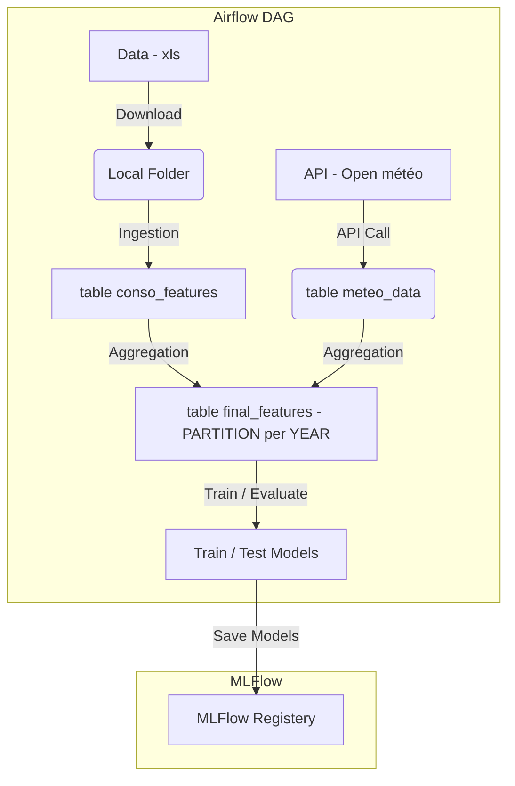

## Lancer la Base PostgreSQL et MLFlow

```bash
docker-compose build
```

```bash
docker-compose up -d
```

La Base de Données est accessible sur : 

```py
HOST="localhost"
DB="postgres"
USER="postgres"
PASSWORD="postgres"
PORT=5441
```
MLFlow est accessible sur : 

```sh
http://localhost:5000
```

## Infrastructure



Pour 26 Janvier :

- Modèle à monter qui tourne avec bon score
- Dockeriser si possible

Sebastien : 
- 

Cyril :
- 

Hugo :
- Analyse exploratoire + Matrice de corrélation