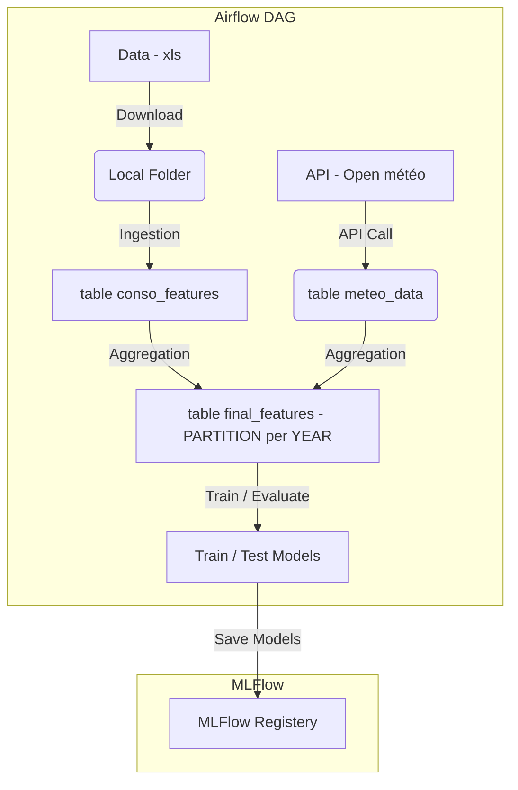

## Lancer la Base PostgreSQL

```bash
docker build -t postgres_db .
```

```bash
docker run -d -p 5441:5432 --name postgres_db postgres_db
```

## Infrastructure



Pour 26 Janvier :

- Modèle à monter qui tourne avec bon score
- Dockeriser si possible

Sebastien : 
- 

Cyril :
- 

Hugo :
- Analyse exploratoire + Matrice de corrélation