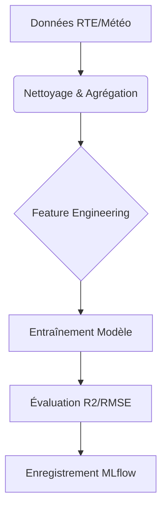

# Règles métier

## Résumé

Le projet EDF-MSPR3 automatise la prévision de la consommation électrique. Les règles métier reposent sur l'intégration de données historiques (RTE éCO2mix) et météorologiques pour entraîner des modèles de régression. Le workflow est standardisé par l'utilisation de MLflow pour la gestion du cycle de vie des modèles.

## Vue d’ensemble

Les règles métier définissent comment les données brutes sont transformées en outils d'aide à la décision. Le système suit une logique de pipeline séquentielle : extraction, enrichissement temporel, modélisation et versioning.

:::info
Les règles listées ci-dessous sont déduites de l'analyse des scripts de traitement (`src/data/`, `src/modeling/`).
:::

## Schéma

## Détails

### Ingestion et préparation
- **Granularité** : Les données sont traitées à une échelle temporelle (aggrégation horaire).
- **Source** : Fusion des données de consommation d'énergie et des relevés de température via l'API Open-Meteo.
- **Nettoyage** : Suppression ou imputation des valeurs manquantes avant la phase de calcul des variables.

### Modélisation
- **Approche** : Utilisation de modèles de régression (Linear Regression, RandomForest, KNN).
- **Indicateurs de performance** : Le succès d'un modèle est mesuré par le coefficient de détermination (R2), la racine de l'erreur quadratique moyenne (RMSE) et le pourcentage d'erreur absolue moyenne (MAPE).

### Versioning
- **Standardisation** : Tout modèle retenu doit être enregistré sous le nom `MODEL_EDF` dans MLflow.
- **Traçabilité** : Le déploiement ne peut être validé sans une corrélation entre les métriques d'évaluation et l'artefact `.joblib`.

## Tableau de synthèse

| Règle | Type | Application |
|---|---|---|
| Agrégation horaire | Technique | Pré-traitement |
| Calcul de variables temporelles | Fonctionnelle | Feature Engineering |
| Métriques de succès (R2, RMSE, MAPE) | Métier | Sélection de modèle |
| Nomenclature `MODEL_EDF` | Standard | MLflow |

## Points d’attention

- **Dépendance externe** : La qualité du modèle dépend directement de la continuité de l'API Open-Meteo et de la disponibilité des données éCO2mix.
- **Non-stationnarité** : En cas de changement brutal des habitudes de consommation, le modèle pourrait nécessiter un réentraînement complet.

## Hypothèses à valider

- **Qualité des données** : Nous supposons que le format des fichiers sources dans `data/` respecte scrupuleusement la structure attendue par `data_loader.py`.
- **Validation humaine** : Il n'est pas clair dans le code si une validation manuelle est requise avant le passage en production du modèle dans MLflow.
- **Fréquence** : La périodicité réelle du réentraînement (journalière, hebdomadaire ?) n'est pas explicitée dans les scripts de configuration.

## Sources utilisées

- `src/data/data_loader.py`
- `src/data/weather_loader.py`
- `src/modeling/train.py`
- `src/mlflow/push_model_to_mlflow.py`
- README du projet