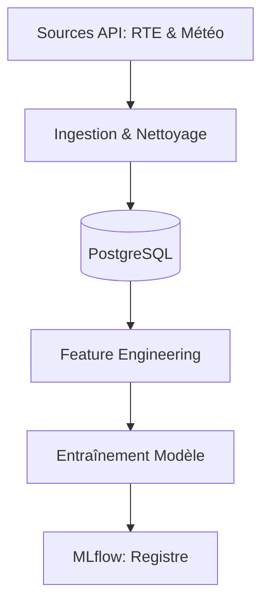

# Flux fonctionnel des données

## Résumé
Le système EDF-MSPR3 automatise la transformation de données brutes énergétiques et météorologiques en outils de prévision. Le flux suit une chaîne logique : acquisition, stockage, enrichissement, entraînement et enfin archivage des modèles.

## Vue d’ensemble

Le processus transforme des données hétérogènes en modèles de prédiction grâce à une architecture structurée. Les données sont extraites de sources distantes, nettoyées, stockées dans une base PostgreSQL, puis utilisées pour entraîner des modèles dont la performance est suivie via MLflow.

## Schéma

## Détails

### Acquisition et Stockage
*   **Sources** : Le système interroge les API RTE (consommation) et Open-Meteo (conditions climatiques).
*   **Persistance** : Les données sont consolidées dans une base de données PostgreSQL dédiée, assurant une base de travail propre pour les modèles.

### Transformation (Feature Engineering)
*   Les données brutes subissent un nettoyage (gestion des formats et caractères spéciaux).
*   Des variables temporelles sont calculées pour enrichir les séries de consommation.
*   Cette étape prépare les données pour optimiser la précision des algorithmes de régression.

### Modélisation et Versioning
*   Le module de modélisation entraîne plusieurs algorithmes (Linear Regression, Random Forest, KNN).
*   Le modèle retenu est poussé vers l'interface **MLflow** pour archivage et suivi des performances.

## Tableau de synthèse

| Étape | Composant | Rôle Fonctionnel |
| :--- | :--- | :--- |
| **Ingestion** | `data_loader.py` | Importation des flux externes |
| **Stockage** | `PostgreSQL` | Persistance des données brutes/propres |
| **Préparation** | `features.py` | Création de variables prédictives |
| **Apprentissage**| `train.py` | Calcul et entraînement des modèles |
| **Versioning** | `MLflow` | Archivage et suivi du cycle de vie |

## Points d’attention

:::warning
La chaîne de données dépend entièrement de la disponibilité des API externes (RTE/Open-Meteo). Une panne de ces services bloque l'entraînement du modèle.
:::

:::tip
Le projet utilise des volumes Docker pour assurer la persistance des données. Assurez-vous que les répertoires locaux sont correctement montés avant le lancement des conteneurs.
:::

## Hypothèses à valider

*   **Automatisation** : Le code `main.py` suggère une exécution manuelle. La migration réelle vers Airflow reste à confirmer par l'ajout des fichiers DAG dans le dossier dédié.
*   **Volumétrie** : La gestion de la montée en charge des données au fil du temps n'est pas explicitement documentée.
*   **Qualité** : La robustesse du nettoyage en cas de données manquantes ou corrompues dans les sources API doit être testée.

## Sources utilisées

*   `docker-compose.yml` (Configuration de l'infrastructure)
*   `src/main.py` (Script d'orchestration global)
*   `src/data/` (Scripts d'ingestion)
*   `src/db/` (Gestion de la base de données)
*   `src/features/` (Logique de transformation)
*   `src/modeling/` (Logique d'entraînement)
*   `src/mlflow/` (Gestion du registre de modèles)