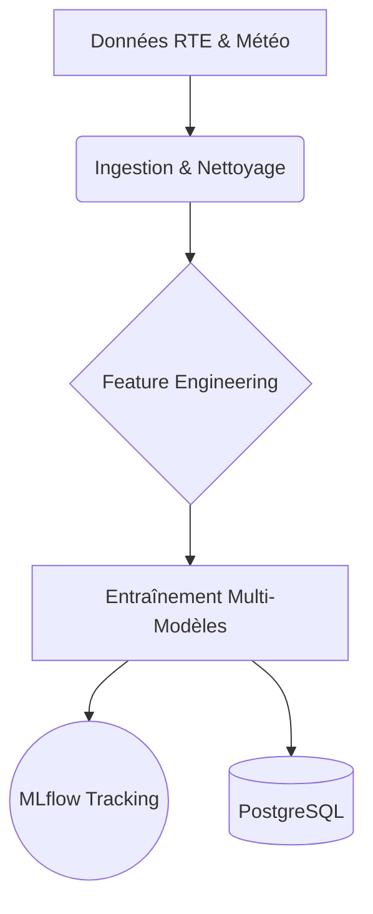

# Fonctionnalités

## Résumé
Le projet **EDF-MSPR3** automatise la chaîne de valeur du Machine Learning pour la prévision de la consommation électrique. Il assure l'ingestion de données énergétiques et météorologiques, la préparation des variables, l'entraînement de modèles prédictifs et leur suivi centralisé.

## Vue d’ensemble
L'architecture fonctionnelle repose sur une automatisation des étapes de traitement de la donnée. Le flux permet de passer de sources externes brutes à un modèle de prédiction prêt à l'emploi.

## Schéma

## Détails

### Ingestion et Nettoyage
Le système automatise la récupération des historiques de consommation électrique (RTE éCO2mix) et des données météorologiques.
- Nettoyage des formats (encodages, colonnes).
- Normalisation des données pour insertion en base.
- Stockage structuré dans PostgreSQL.

### Feature Engineering
Cette étape transforme les données brutes pour améliorer la précision des modèles :
- Création d'indicateurs temporels (saisonnalité, heures).
- Agrégation temporelle des données.
- Traitement des données manquantes.

### Modélisation et Tracking
Le pipeline entraîne des modèles de Machine Learning via `scikit-learn`.
- Comparaison de plusieurs algorithmes.
- Enregistrement automatique des performances dans **MLflow**.
- Sauvegarde des meilleurs modèles sous forme d'artefacts.

## Tableau de synthèse

| Fonctionnalité | État | Composant / Script |
| :--- | :--- | :--- |
| Ingestion Données | Confirmé | `src/data/downloader.py` |
| Feature Engineering | Confirmé | `src/features/features.py` |
| Entraînement ML | Confirmé | `src/main.py` |
| Tracking MLflow | Confirmé | `src/mlflow/push_model_to_mlflow.py` |
| Orchestration | Documenté | Airflow (via `docker-compose`) |

:::tip
Le serveur MLflow (port 5000) offre une interface graphique pour visualiser les métriques de vos modèles après chaque exécution.
:::

## Points d’attention
* **Gestion des accès** : Le dossier `mlflow/` nécessite des droits en écriture (`777`) pour la persistence des artefacts de modèles.
* **Dépendances API** : Le pipeline dépend de la disponibilité des APIs externes (RTE et Open-Meteo). Aucune logique de réessai (retry) n'est explicitement visible dans le code fourni.

## Hypothèses à valider
* **Statut des DAGs** : Le dossier `/dags` est présent dans la structure, mais aucun fichier de pipeline Airflow n'a été analysé. L'automatisation via Airflow est documentée mais non vérifiée dans le code source fourni.
* **Configuration des secrets** : Les fichiers de configuration (`env_files/secrets.env`) n'ont pas été analysés ; il faut s'assurer qu'aucune information sensible n'est requise pour l'exécution locale.

## Sources utilisées
* `docker-compose.yml` (Configuration infrastructure)
* `src/main.py` (Flux principal)
* `src/data/downloader.py` (Script d'ingestion)
* `src/features/features.py` (Script de transformation)
* `src/mlflow/push_model_to_mlflow.py` (Module de suivi)