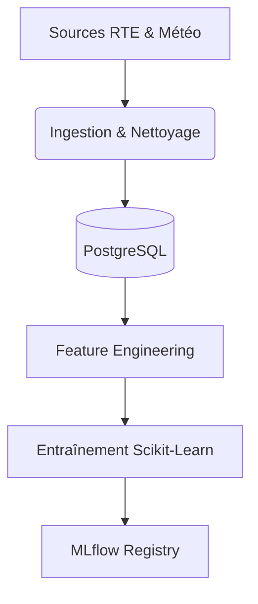

# Vue d’ensemble fonctionnelle

## Résumé

Le projet **EDF-MSPR3** est une plateforme MLOps conçue pour prédire la consommation électrique. Il automatise la collecte de données (RTE et Météo), le traitement des variables, l'entraînement de modèles prédictifs et leur versionnage via MLflow. Ce système centralise les données dans une base PostgreSQL pour faciliter l'analyse décisionnelle.

## Vue d’ensemble

La solution agit comme un pipeline de traitement "Back-office". Elle transforme des données brutes hétérogènes en modèles de prévision robustes. L'objectif est de corréler la consommation historique avec les conditions météorologiques pour anticiper les variations de la demande énergétique.

:::info
Le système est conçu pour être modulaire. Il permet aux Data Scientists d'itérer rapidement sur les modèles tout en assurant une traçabilité complète des résultats via MLflow.
:::

## Schéma

## Détails

### Objectifs métier
*   **Prévision** : Estimer la consommation électrique future.
*   **Corrélation** : Mesurer l'impact des variations climatiques sur la demande.
*   **Standardisation** : Automatiser le cycle de vie du modèle, de la donnée brute au registre de modèle.

### Parcours de traitement
1. **Collecte** : Récupération des archives éCO2mix et des données météo Open-Meteo.
2. **Stockage** : Normalisation et insertion dans une base de données PostgreSQL.
3. **Préparation** : Transformation des données brutes en variables exploitables (features).
4. **Modélisation** : Entraînement de modèles et enregistrement dans MLflow pour suivi.

## Tableau de synthèse

| Fonctionnalité | Rôle | Statut (Code) |
| :--- | :--- | :--- |
| **Ingestion** | Import données RTE et Météo | Confirmé |
| **Stockage** | Persistance dans PostgreSQL | Confirmé |
| **MLOps** | Registry de modèles (MLflow) | Confirmé |
| **Orchestration** | Automatisation des pipelines | Déployable (Infra) |
| **Analyse** | Modélisation Scikit-Learn | Confirmé |

## Points d’attention

:::warning
Le pipeline dépend de sources externes (API météo, serveurs RTE). Toute modification de ces interfaces nécessite une mise à jour des scripts d'ingestion.
:::

:::tip
Utilisez l'interface MLflow (port 5000) pour comparer visuellement les performances des différentes versions de vos modèles.
:::

## Hypothèses à valider

*   **Disponibilité des DAGs** : La structure Airflow est présente, mais aucun script de planification (DAG) n'est confirmé dans les fichiers analysés.
*   **Données historiques** : La complétude des données d'entraînement stockées localement doit être vérifiée avant toute exécution de `src/main.py`.
*   **Configuration environnement** : La connexion aux bases de données repose sur des variables d'environnement externes (`secrets.env`) non fournis ici.
*   **Finalité** : L'absence d'interface de consultation (API ou Dashboard utilisateur) confirme qu'il s'agit actuellement d'un environnement d'entraînement et de recherche.

## Sources utilisées

*   `docker-compose.yml` (Définition de l'infrastructure)
*   `src/main.py` (Orchestration du pipeline)
*   `src/data/weather_loader.py` (Source données météo)
*   `src/db/ingestion_pg.py` (Logique de stockage)
*   `src/mlflow/push_model_to_mlflow.py` (Intégration MLflow)
*   `README.md` (Contexte fonctionnel)