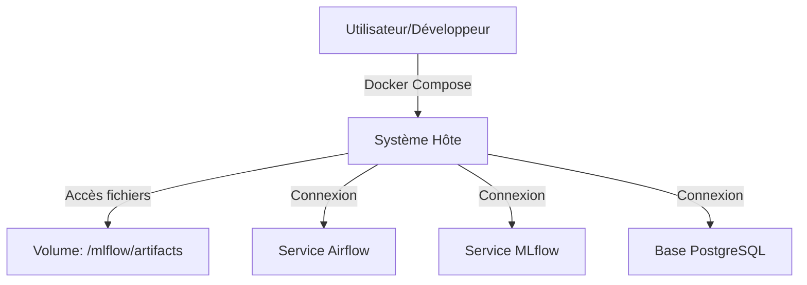

# Permissions

## Résumé
Ce document détaille la gestion des accès et des permissions au sein de l'infrastructure EDF-MSPR3. La sécurité repose principalement sur des configurations d'accès aux conteneurs, au stockage local et aux services de gestion de modèles et de données.

## Vue d’ensemble

Le projet utilise une approche basée sur des services isolés via Docker Compose. Les accès sont principalement gérés au niveau des variables d'environnement des conteneurs et des permissions de fichiers sur l'hôte pour les volumes montés.

:::warning
Aucune authentification forte n'est explicitement configurée dans les fichiers `docker-compose.yml` fournis (usage de comptes par défaut suggéré dans le README).
:::

## Schéma

## Détails

### Accès aux services
L'accès aux interfaces est géré par l'exposition de ports TCP via Docker.
*   **Airflow** : Accessible via le port 8080.
*   **MLflow** : Accessible via le port 5000.
*   **PostgreSQL** : Accessible via les ports 5432 (MLflow) et 5441 (Métier).

### Permissions de fichiers
Le repository nécessite des droits en lecture/écriture sur le dossier `mlflow/` pour permettre la persistance des modèles et des artefacts.
*   **Action courante** : `chmod -R 777 mlflow` (Commande identifiée dans les logs de documentation pour résoudre les conflits de droits entre le conteneur et l'hôte).

### Gestion des secrets
*   Les accès aux bases de données sont définis par des variables d'environnement (`POSTGRES_USER`, `POSTGRES_PASSWORD`).
*   Aucun fichier `.env` n'est analysé, mais le code source suggère une configuration dynamique.

## Tableau de synthèse

| Composant | Type de contrôle | Niveau de gestion |
|---|---|---|
| Conteneurs | Docker Compose | Orchestration via `docker-compose.yml` |
| Artefacts MLflow | Système de fichiers | Droits Linux sur `/mlflow/artifacts` |
| Base de données | Authentification | Login/Mot de passe (env) |
| Interface Web | Aucun (identifié) | À sécuriser selon le README |

## Points d’attention

*   **Risque de sécurité** : L'utilisation de `chmod 777` est une pratique risquée sur des serveurs partagés ou exposés, car elle donne des droits de lecture/écriture complets à tous les utilisateurs du système.
*   **Absence de cloisonnement** : Aucune configuration de réseau interne (Docker Networks) restreignant les accès entre les services n'a été confirmée.

## Hypothèses à valider

*   **Authentification Airflow** : Vérifier si des variables d'environnement (`AIRFLOW__WEBSERVER__RBAC`) sont activées pour limiter l'accès à l'interface.
*   **User Mapping** : Vérifier si le conteneur Docker tourne en tant qu'utilisateur `root` ou via un utilisateur non privilégié (spécifié dans le `Dockerfile`).
*   **Rôles PostgreSQL** : Déterminer si le schéma de base de données est cloisonné par utilisateur ou si une seule connexion administrative est utilisée pour toutes les opérations.

## Sources utilisées

*   `docker-compose.yml`
*   README (Informations sur les accès par défaut)
*   Commandes répertoriées dans les notes d'inventaire (`chmod`)