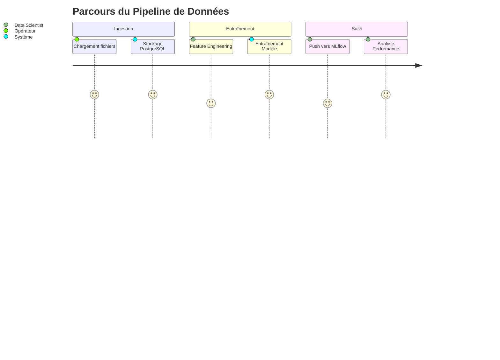

# Parcours utilisateurs

## Résumé

Ce document décrit les interactions entre les différents intervenants techniques et le pipeline de données EDF-MSPR3. Le flux de travail s'articule autour de l'orchestration automatique (Airflow), de la gestion des données (PostgreSQL) et du cycle de vie des modèles (MLflow).

## Vue d’ensemble

Le projet est conçu pour automatiser la chaîne de valeur de la donnée énergétique. Les parcours se divisent en deux catégories principales :
- **Parcours Opérateur (Data Engineering) :** Maintien de l'infrastructure et supervision des flux.
- **Parcours Data Scientist :** Entraînement, évaluation et versioning des modèles de prédiction.

## Schéma

Le flux de données global suit une progression logique du stockage vers l'analyse.

## Détails

### 1. Ingestion et Préparation
L'opérateur lance le pipeline via l'orchestrateur. Les données brutes (historiques de consommation et données météo) sont ingérées dans la base PostgreSQL (`edf_postgresl`). Ce processus transforme les fichiers locaux en une structure cohérente pour la modélisation.

### 2. Entraînement et Modélisation
Le Data Scientist exécute les scripts de `src/modeling/`. Le système :
- Récupère les données préparées.
- Applique les variables temporelles.
- Compare plusieurs modèles (LinearRegression, RandomForest, KNN).
- Calcule les métriques de performance (RMSE, R2, MAPE).

### 3. Gestion du cycle de vie (MLflow)
Une fois le meilleur modèle identifié, l'utilisateur utilise le script `push_model_to_mlflow.py`. Cela permet de :
- Versionner le modèle `MODEL_EDF`.
- Garantir la traçabilité des essais.
- Permettre le déploiement ultérieur.

## Tableau de synthèse

| Profil | Action principale | Outil utilisé | Fréquence |
| :--- | :--- | :--- | :--- |
| **Data Engineer** | Supervision des flux | Airflow (UI) | Quotidienne |
| **Data Scientist** | Entraînement modèle | `src/main.py` | À la demande |
| **Data Scientist** | Enregistrement modèle | MLflow (UI/Script) | Après validation |

:::tip
L'interface MLflow (port 5000) permet de comparer visuellement les performances des différents runs d'entraînement.
:::

## Points d’attention

* **Volumes :** Assurez-vous que les droits sur les dossiers de stockage (ex: `mlflow/`) sont correctement configurés pour éviter les erreurs d'écriture (`chmod` nécessaire).
* **Dépendances :** Le pipeline repose sur la disponibilité de l'API Open-Meteo pour les données exogènes.
* **Orchestration :** Les DAGs Airflow doivent être monitorés pour identifier les échecs de rafraîchissement des données.

## Hypothèses à valider

* La structure exacte des tables dans `edf_postgresl` nécessite une validation par une inspection directe du schéma SQL.
* Le contenu des DAGs Airflow est déduit et n'a pas été analysé en profondeur dans le code source actuel.
* Il est supposé que l'utilisateur a accès aux instances Docker via le réseau local défini dans `docker-compose.yml`.

## Sources utilisées

* `README.md`
* `docker-compose.yml`
* `src/mlflow/push_model_to_mlflow.py`
* `src/modeling/train.py`
* `src/db/ingestion_pg.py`