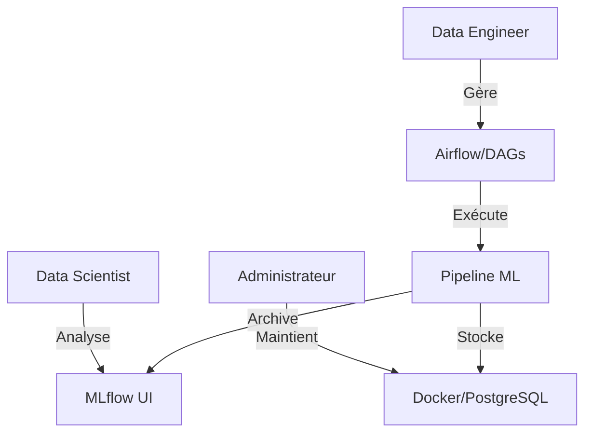

# Rôles utilisateurs

## Résumé
Le projet EDF-MSPR3 est un environnement MLOps automatisé. Bien que les outils soient configurés pour une interaction machine, trois profils d'utilisateurs humains peuvent être identifiés ou déduits pour assurer le fonctionnement, la maintenance et l'exploitation des modèles de prévision.

## Vue d’ensemble

Les rôles sont définis par la manipulation des services techniques (Airflow, MLflow, Docker) et l'exploitation des résultats (modèles, prévisions).

*   **Data Engineer / ML Engineer :** Responsable du pipeline de données et de l'entraînement.
*   **Data Scientist :** Utilisateur du tracking MLflow pour l'expérimentation.
*   **Administrateur Système (DevOps) :** Responsable du déploiement Docker et de l'intégrité des bases de données.

## Schéma

## Détails

### Data Engineer / ML Engineer
Ce profil interagit avec le code source pour maintenir le pipeline automatisé.
*   **Responsabilités :** Assurer l'ingestion des données (RTE, API Météo), configurer les DAGs Airflow et gérer les scripts Python (`src/`).
*   **Outils :** Terminal, IDE, Docker Compose.

### Data Scientist
Il se concentre sur la performance des modèles de prévision de consommation.
*   **Responsabilités :** Comparer les performances des algorithmes (RandomForest, KNN, LinearRegression), valider les métriques (R2, RMSE) via l'interface MLflow.
*   **Outils :** Interface web MLflow, Notebooks (si utilisés).

### Administrateur Système
Il garantit que l'infrastructure est disponible et sécurisée.
*   **Responsabilités :** Gestion des volumes (artifacts MLflow), démarrage des conteneurs, sauvegarde des bases PostgreSQL.
*   **Outils :** Docker CLI, PostgreSQL client.

## Tableau de synthèse

| Profil | Responsabilité principale | Interface privilégiée |
|---|---|---|
| **Data Engineer** | Automatisation des flux (DAGs) | IDE / CLI |
| **Data Scientist** | Analyse et versioning modèles | MLflow UI |
| **Administrateur** | Disponibilité infrastructure | Docker CLI |

:::info
Le projet est conçu pour une exécution automatisée. L'interaction humaine se limite principalement à la supervision des interfaces MLflow et Airflow.
:::

## Points d’attention

*   **Accès :** Les accès par défaut (ex: `admin`/`admin`) doivent être sécurisés rapidement si l'infrastructure est exposée.
*   **Droits :** Le script de correction des droits (`chmod -R 777 mlflow`) indique une dépendance sur les permissions système qui peut varier selon l'environnement hôte.
*   **Responsabilités :** En l'absence de rôle RBAC (Role-Based Access Control) configuré explicitement dans le code, la gestion des accès est une responsabilité logicielle ou réseau externe.

## Hypothèses à valider

*   **Existence de DAGs :** Le dossier `dags/` est vide. L'hypothèse est qu'un Data Engineer doit encore y implémenter la logique de workflow.
*   **Utilisation des Notebooks :** Bien que mentionnés comme possibles, aucun `.ipynb` n'est présent. À confirmer si les Data Scientists utilisent des environnements isolés pour l'exploration.
*   **Séparation des rôles :** Dans le contexte actuel du dépôt, un seul développeur semble effectuer l'ensemble des tâches (déduit par la structure des scripts).

## Sources utilisées

*   `docker-compose.yml` (Définition des services et ports).
*   `src/mlflow/push_model_to_mlflow.py` (Workflow d'interaction avec le registre).
*   `src/main.py` (Logique globale d'exécution).
*   README.md (Informations sur l'infrastructure).