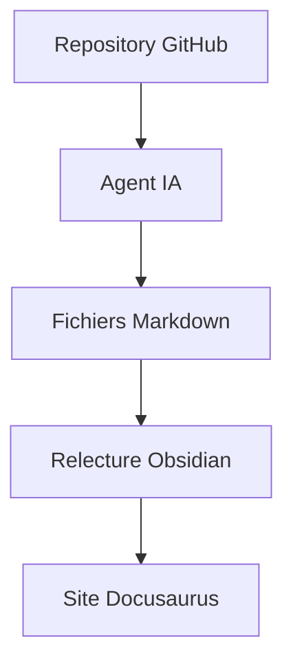

# Introduction

Bienvenue dans la documentation du projet **EDF-MSPR3**.

Cette documentation centralise les informations techniques et fonctionnelles du projet : architecture MLOps, flux de données, orchestration Airflow, tracking MLflow, base PostgreSQL et traitements Python.

:::info
Cette documentation est générée et améliorée avec l’aide d’un agent IA, puis relue et maintenue manuellement.
:::

## Objectifs de la documentation

Cette documentation doit permettre de :

- comprendre le fonctionnement global du projet ;
- expliquer les flux de données ;
- documenter les composants techniques ;
- faciliter la reprise du projet par un développeur ou un mainteneur ;
- conserver une trace des choix d’architecture.

## Sections principales

| Section | Description |
|---|---|
| Documentation fonctionnelle | Objectifs métier, fonctionnalités, flux de données et parcours |
| Documentation technique | Architecture, Docker, Airflow, MLflow, PostgreSQL et pipelines |
| Suivi IA | Rapport de génération et points à vérifier |

## Cycle documentaire



## Lecture recommandée

Commence par :

- Vue d’ensemble fonctionnelle
- Architecture technique
- Airflow et DAGs
- MLflow

---

## Nettoyer et relancer

Depuis la racine du projet :

```powershell
cd docs
Remove-Item -Recurse -Force ".docusaurus" -ErrorAction SilentlyContinue
npm install
npm run start