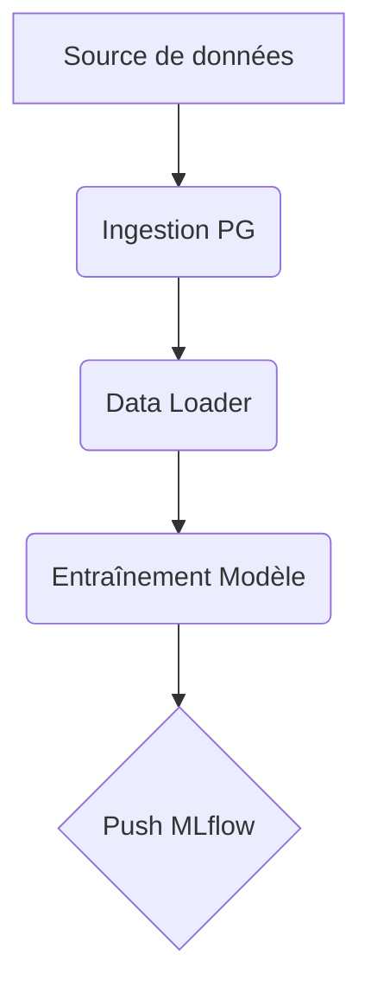

# Airflow et DAGs

## Résumé
Airflow est configuré comme l'orchestrateur central du projet via `docker-compose.yml`. Il est destiné à automatiser les workflows d'ingestion, de transformation et d'entraînement. **Note :** Aucun fichier de définition de DAG n'est présent dans le répertoire analysé à ce jour.

## Vue d’ensemble

Le service Airflow est conteneurisé. Son fonctionnement repose sur le montage d'un volume local (`./dags`) vers le répertoire interne du conteneur. Cette architecture permet de synchroniser les pipelines Python avec l'instance Airflow en cours d'exécution.

:::info
Le service Airflow est défini dans le fichier `docker-compose.yml` avec les composants classiques du scheduler et du webserver.
:::

## Schéma

Le flux théorique de l'orchestration, basé sur la structure des dossiers sources, se présente comme suit :

## Détails

### Configuration
Le service Airflow est déployé via Docker Compose. La persistance des DAGs est assurée par un montage de volume local. 

*   **Volume monté** : `./dags` (hôte) vers `/opt/airflow/dags` (conteneur).
*   **Accès** : L'interface web est exposée sur le port `8080` (confirmé par `docker-compose.yml`).

### Orchestration attendue
Bien que les fichiers `.py` de DAGs ne soient pas fournis, la logique métier présente dans le dossier `src/` suggère des étapes d'automatisation :
1. **Extraction** : Ingestion des données RTE (eCO2mix).
2. **Transformation** : Exécution des scripts de nettoyage et de feature engineering.
3. **Modélisation** : Lancement des scripts d'entraînement (`train_models`).
4. **Registry** : Enregistrement du modèle `.joblib` dans MLflow.

## Tableau de synthèse

| Composant | État | Source |
| :--- | :--- | :--- |
| Service Airflow | Actif dans `docker-compose.yml` | `docker-compose.yml` |
| Répertoire DAGs | `./dags` | Configuration Docker |
| Fichiers DAG | **Absents** | Inspection repo |
| Port Web | 8080 | `docker-compose.yml` |

## Points d’attention

*   **Absence de code** : Aucun fichier DAG n'est présent. Les pipelines sont actuellement déclenchables manuellement via des scripts Python isolés dans `src/`.
*   **Gestion des variables** : L'authentification par défaut pour l'interface Airflow est documentée dans le README, mais n'est pas sécurisée pour un environnement de production.
*   **Risque de droits** : Le montage de volume nécessite parfois une gestion spécifique des permissions (UID/GID) pour que l'utilisateur `airflow` puisse lire les fichiers.

## À vérifier manuellement

*   Vérifier si le dossier `dags` est correctement créé à la racine du projet avant le `docker-compose up`.
*   Tester la connectivité entre le conteneur Airflow et la base de données PostgreSQL (`edf_postgresl`) via le réseau Docker.
*   Valider si les variables d'environnement nécessaires aux DAGs sont correctement définies dans le fichier `.env` (non analysé).

## Sources utilisées

*   `docker-compose.yml`
*   `README.md`
*   Structure des répertoires du projet.