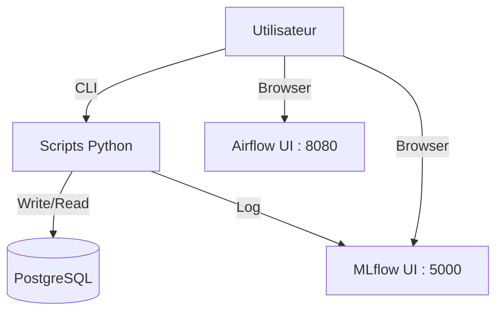

# API

## Résumé

Le repository **EDF-MSPR3** ne contient pas d'API RESTful exposée via un framework web (type FastAPI ou Flask) pour interagir avec les modèles ou les données. L'accès aux fonctionnalités se fait via des scripts Python et des interfaces d'administration.

## Vue d’ensemble

Les points d'entrée "API" dans ce projet sont soit des interfaces d'administration de services tiers, soit des exécutions de scripts en ligne de commande. Il n'existe pas de route HTTP personnalisée développée pour exposer les prédictions ou les données métier.

## Schéma des interfaces

## Détails

### Interfaces tierces
*   **Airflow UI** : Interface de contrôle pour la planification des tâches. Accessible via le port `8080` (authentification par défaut : `admin/admin`).
*   **MLflow UI** : Interface pour le suivi des expérimentations et le registre des modèles. Accessible via le port `5000`.

### Points d'entrée programmatiques
*   **Ingestion** : Le script `src/db/ingestion_pg.py` sert de point d'entrée pour le chargement des données.
*   **Entraînement** : Le script `src/main.py` exécute la logique de pipeline de bout en bout.
*   **Export MLflow** : Le script `src/mlflow/push_model_to_mlflow.py` permet d'enregistrer des modèles dans le registre.

## Tableau de synthèse

| Composant | Type | Accès | Rôle |
| :--- | :--- | :--- | :--- |
| **Airflow UI** | Web | Port 8080 | Pilotage des pipelines (DAGs) |
| **MLflow UI** | Web | Port 5000 | Visualisation des runs et modèles |
| **Scripts Python** | CLI | Terminal | Ingestion, Training, Export |

:::info
Il n'existe aucun endpoint d'API (REST ou gRPC) documenté ou présent dans le code source fourni pour interroger les modèles en temps réel.
:::

## Points d’attention

*   **Absence d'API Service** : Aucune application web (FastAPI/Flask) n'est déployée dans le `docker-compose.yml` pour servir de couche d'inférence.
*   **Sécurité** : Les interfaces Web (Airflow, MLflow) sont exposées localement sans configuration SSL/TLS visible dans les fichiers fournis.

## À vérifier manuellement

*   Vérifier si un fichier `app.py` ou `server.py` aurait été omis dans la racine du projet (absent de l'inventaire actuel).
*   Confirmer si des fonctions spécifiques dans les scripts `src/` exposent des méthodes de type `serve` ou `predict` non utilisées dans le pipeline actuel.

## Sources utilisées

*   `docker-compose.yml`
*   `src/main.py`
*   `src/db/ingestion_pg.py`
*   `src/mlflow/push_model_to_mlflow.py`