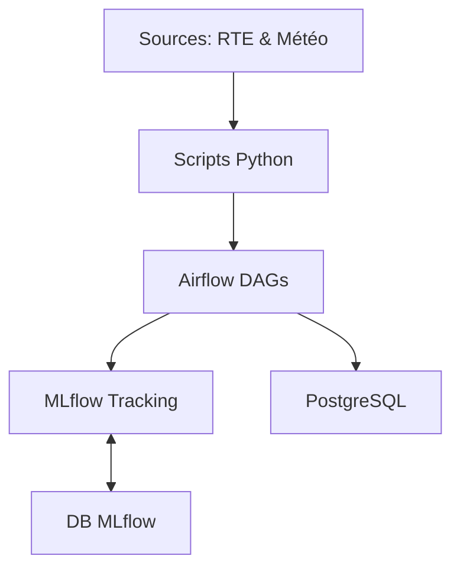

# Architecture technique

## Résumé

Le projet **EDF-MSPR3** repose sur une architecture conteneurisée orchestrant trois piliers : l'ordonnancement des pipelines (**Airflow**), le suivi du cycle de vie ML (**MLflow**) et la persistance des données (**PostgreSQL**). Ce système permet d'automatiser l'ingestion, le traitement et l'entraînement des modèles de prévision énergétique.

## Vue d’ensemble

L'architecture centralise les composants via `docker-compose.yml`. Les services communiquent via des réseaux Docker internes pour assurer l'isolement et la sécurité. Le flux de données circule entre les sources externes (API météo, RTE), les scripts de transformation Python et les outils de stockage.

## Schéma

## Détails

### Orchestration (Docker Compose)
Le fichier `docker-compose.yml` définit quatre services principaux. Chaque service utilise des volumes montés pour assurer la persistance des données entre les redémarrages des conteneurs.

### Pipelines (Airflow)
Le dossier `dags/` contient la logique d'ordonnancement. Airflow déclenche les scripts situés dans `src/` pour assurer l'ingestion des données éCO2mix et la mise à jour des modèles.

### Tracking (MLflow)
Le serveur MLflow centralise les métriques d'entraînement et les artefacts. Il utilise sa propre instance PostgreSQL pour stocker les métadonnées des expériences.

## Tableau de synthèse

| Composant | Service Docker | Port (Hôte) | Responsabilité |
| :--- | :--- | :--- | :--- |
| **Orchestration** | `airflow` | 8080 | Pilotage des tâches |
| **Modélisation** | `mlflow` | 5000 | Tracking et registre |
| **Données Métier** | `edf_postgresl` | 5441 | Stockage consommation |
| **Données MLflow** | `db_mlflow` | Interne | Stockage des métadonnées |

:::tip
Les ports 8080 et 5000 doivent être disponibles sur votre machine hôte pour éviter les conflits de démarrage.
:::

## Points d’attention

*   **Gestion des volumes** : Les données ingérées dépendent du montage correct des volumes locaux spécifiés dans le `docker-compose.yml`.
*   **Sécurité** : Les accès aux bases de données et aux services sont configurés par défaut dans le fichier compose. Veillez à ne pas exposer ces ports sur un réseau public.
*   **Performance** : L'entraînement de modèles lourds (ex: RandomForest) peut impacter les ressources disponibles du conteneur.

## À vérifier manuellement

*   Vérifier que le répertoire `dags/` contient bien les fichiers `.py` attendus par le service Airflow.
*   Confirmer la connectivité réseau entre le conteneur Python et le service `edf_postgresl` lors de l'ingestion initiale.
*   Vérifier les droits en écriture sur le dossier `./mlflow/artifacts` si le serveur MLflow retourne des erreurs de permission.

## Sources utilisées

*   `docker-compose.yml` (Configuration des services et ports)
*   `src/data/data_loader.py` (Flux d'ingestion des données)
*   `src/mlflow/push_model_to_mlflow.py` (Interaction avec le serveur MLflow)
*   `src/db/ingestion_pg.py` (Interaction avec la base de données PostgreSQL)