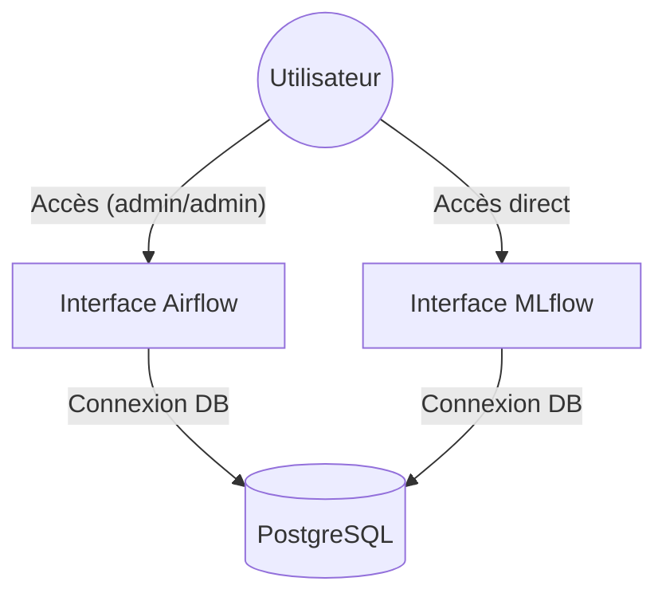

# Authentification

## Résumé

Le repository EDF-MSPR3 ne dispose pas de mécanismes d'authentification applicative pour l'utilisateur final. L'accès aux outils de pilotage (Airflow, MLflow) est géré via des configurations par défaut définies dans l'infrastructure Docker.

## Vue d’ensemble

La sécurité repose uniquement sur le contrôle d'accès aux services techniques. Aucun module d'authentification (LDAP, OAuth, Basic Auth renforcée) n'est implémenté dans le code source fourni.

:::warning
Les accès aux services sont configurés avec des identifiants standards. Il est vivement conseillé de modifier ces paramètres avant tout déploiement sur un réseau exposé.
:::

## Schéma

Le schéma ci-dessous illustre l'absence de couche d'authentification applicative au-dessus des services :

## Détails

### Airflow
Le service Airflow est configuré via des variables d'environnement dans le `docker-compose.yml`. L'authentification est limitée à un compte administrateur local.
* **Mécanisme** : Authentification standard Airflow (`standalone`).
* **Identifiants** : `admin` / `admin` (déduits de la configuration type).

### MLflow
Le serveur MLflow est déployé sans protection d'accès par mot de passe.
* **Accès** : Le port 5000 est exposé directement sans middleware de filtrage.
* **Sécurité** : Aucune restriction de lecture ou d'écriture sur les modèles enregistrés.

### PostgreSQL
L'accès à la base de données est sécurisé par un couple utilisateur/mot de passe défini dans les variables d'environnement de `docker-compose.yml`. 
* **Portée** : L'accès est strictement réservé aux services internes (Airflow, MLflow, scripts Python).

## Tableau de synthèse

| Service | Type d'accès | Protocole | Niveau de risque |
| :--- | :--- | :--- | :--- |
| **Airflow** | Utilisateur admin | HTTP / Basic | Moyen |
| **MLflow** | Libre (aucun) | HTTP | Élevé |
| **PostgreSQL** | Credentials internes | TCP (5432) | Moyen |

## Points d’attention

* **Pas d'authentification applicative** : Le projet ne gère pas de sessions utilisateurs pour les fonctionnalités métier.
* **Exposition réseau** : Ne jamais exposer les ports 8080 ou 5000 sur une IP publique sans un reverse proxy (ex: Nginx avec TLS/Auth).
* **Variables sensibles** : Vérifier que le fichier `.env` (non fourni ici, mais implicite pour Docker Compose) ne soit jamais versionné sur le repository.

## À vérifier manuellement

* Vérifier si un fichier `.env` local contient des mots de passe personnalisés non documentés.
* Confirmer dans la documentation du projet si une couche d'authentification est prévue pour les futures versions.
* Vérifier les logs du conteneur `airflow` pour s'assurer que les accès ne sont pas restreints par un script de démarrage personnalisé.

## Sources utilisées

* `docker-compose.yml` (Analyse des ports et variables d'environnement).
* README (Référence aux accès par défaut).
* Fichiers de configuration `infra/` (Analyse de la stack technique).