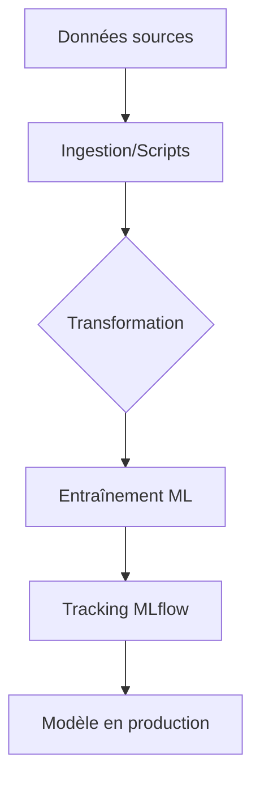

# Backend

## Résumé
Le backend du projet EDF-MSPR3 repose sur des scripts Python modulaires traitant l'ingestion de données énergétiques et météorologiques, l'entraînement de modèles de machine learning et leur intégration avec MLflow. L'exécution est orchestrée via Airflow et s'appuie sur une infrastructure conteneurisée.

## Vue d’ensemble

Le backend est structuré autour de quatre piliers fonctionnels localisés dans le répertoire `src/` :
- **Ingestion** : Récupération des données via API (Open-Meteo) et fichiers locaux (RTE).
- **Transformation** : Nettoyage et préparation des jeux de données.
- **Entraînement** : Pipelines de modélisation (RandomForest, KNN, Régression).
- **Service MLflow** : Gestion du cycle de vie des modèles.

## Schéma

Le flux de données technique suit une logique séquentielle :

## Détails

### Ingestion et Transformation
La logique métier est contenue dans des scripts Python isolés. L'ingestion s'appuie sur des bibliothèques standards (`pandas`, `requests`). Les données brutes transitent par des processus de normalisation (nettoyage de colonnes, typage) avant d'être persistées.

### Entraînement et Modélisation
Les modèles sont entraînés via des scripts dédiés qui permettent :
- L'évaluation des performances (métriques R2, RMSE, MAPE).
- L'exportation des modèles entraînés au format binaire (`joblib`).
- L'interfaçage avec MLflow pour la traçabilité des paramètres et des résultats.

### Services Internes
Le backend interagit avec trois services distincts via `docker-compose.yml` :
- **PostgreSQL (data)** : Stockage des séries temporelles (météo).
- **PostgreSQL (MLflow)** : Stockage des métadonnées de tracking ML.
- **MLflow Server** : API de gestion des modèles.

## Tableau de synthèse

| Composant | Rôle | Source |
|---|---|---|
| `downloader.py` | Ingestion des données RTE | `src/ingestion/` |
| `weather_loader.py` | Appel API Open-Meteo | `src/ingestion/` |
| `main.py` | Pipeline d'entraînement principal | `src/` |
| `push_model_to_mlflow.py` | Enregistrement modèle | `src/mlflow/` |
| `psycopg2` | Driver PostgreSQL | `requirements.txt` |

:::tip
Les scripts Python utilisent des bibliothèques de manipulation de données standard. Assurez-vous d'installer les dépendances via `requirements.txt` dans votre environnement virtuel.
:::

## Points d’attention
- **Gestion des droits** : Le README signale des problèmes potentiels de droits d'écriture sur le dossier `mlflow/artifacts` ; une correction manuelle (`chmod`) est souvent nécessaire.
- **Stabilité** : La communication avec les bases de données dépend de la disponibilité des conteneurs via Docker Compose.
- **Dépendances** : L'utilisation de `openmeteo-requests` impose une connectivité internet stable pour les tâches d'ingestion.

## À vérifier manuellement
- Vérifier si les variables d'environnement pour la connexion PostgreSQL (hôte, port, utilisateur) dans les scripts Python correspondent exactement à celles définies dans le `docker-compose.yml`.
- Confirmer que le répertoire `data/` contient les fichiers sources nécessaires avant l'exécution du script `main.py`.
- Vérifier la présence des fichiers DAGs dans le dossier `dags/` (non analysés en détail ici).

## Sources utilisées
- `docker-compose.yml`
- `src/` (structure et fichiers identifiés)
- `requirements.txt`
- README du repository