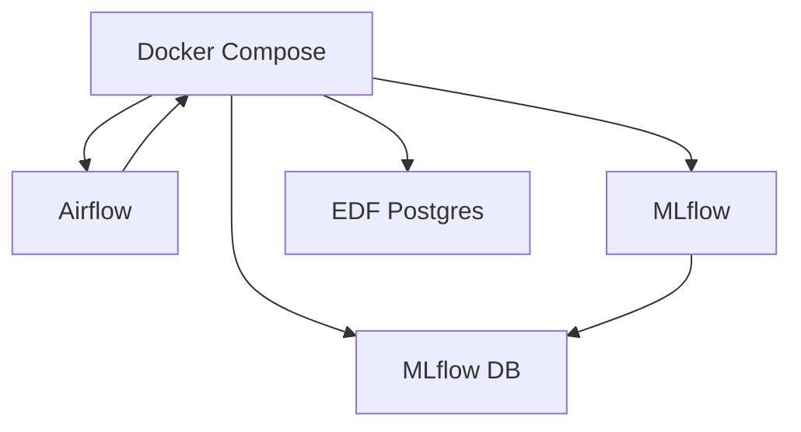

# Configuration

## Résumé
La configuration du projet EDF-MSPR3 repose sur une infrastructure conteneurisée via Docker Compose, centralisant l'orchestration (Airflow), le stockage (PostgreSQL) et le suivi des modèles (MLflow). Les paramètres sont principalement gérés via des fichiers de configuration Docker et des variables d'environnement.

## Vue d’ensemble

Le système utilise deux bases de données PostgreSQL distinctes : l'une dédiée au backend interne de MLflow et l'autre à l'exploitation des données métier (consommation et météo). L'orchestration des services est centralisée dans le fichier `docker-compose.yml`.

## Schéma

## Détails

### Services et Ports
La configuration réseau est définie dans `docker-compose.yml` :
- **Airflow** : Accès interface web sur le port `8080`.
- **MLflow** : Serveur de suivi sur le port `5000`.
- **PostgreSQL (EDF)** : Accessible sur le port `5441` (données métier).
- **PostgreSQL (MLflow)** : Utilisé comme backend interne, sur le port `5432`.

### Gestion des données
Le projet utilise des volumes locaux pour garantir la persistance des données au-delà du cycle de vie des conteneurs :
- `./mlflow/artifacts` : Stockage des modèles et métriques.
- `./postgres_data` : Stockage des données métier.
- `./airflow` : Montages pour les DAGs et les logs.

:::warning
Assurez-vous que les répertoires locaux existent et possèdent les droits en lecture/écriture appropriés pour éviter des erreurs de permission lors du montage des volumes.
:::

## Tableau de synthèse

| Composant | Type | Rôle | Port |
| :--- | :--- | :--- | :--- |
| `airflow` | Service | Orchestration | 8080 |
| `mlflow` | Service | Tracking / Registry | 5000 |
| `db_mlflow` | Service | Base de données MLflow | 5432 |
| `edf_postgresql` | Service | Base de données métier | 5441 |

## Points d’attention
- **Gestion des droits** : Une commande `chmod -R 777 mlflow` est documentée pour corriger les accès aux artifacts, ce qui peut poser des risques de sécurité dans un environnement de production.
- **Différence d'images** : Le service `db_mlflow` utilise une version spécifique de Postgres (10.5), tandis que `edf_postgresql` utilise `latest`.
- **Secrets** : Aucune variable d'environnement critique (mots de passe, clés API) n'est présente dans les fichiers analysés.

## À vérifier manuellement
- **Contenu des DAGs** : Bien que le dossier soit monté, aucun fichier de workflow n'a été vérifié pour confirmer la syntaxe des opérateurs Airflow.
- **Variables d'environnement** : Vérifier si des fichiers `.env` non listés sont nécessaires pour le fonctionnement des scripts Python (`src/`).
- **Initialisation DB** : Vérifier si des scripts d'initialisation SQL sont requis au premier lancement pour créer les tables métier dans `edf_postgresql`.

## Sources utilisées
- `docker-compose.yml`
- `src/mlflow/push_model_to_mlflow.py`
- Inventaire du repository (contexte projet)