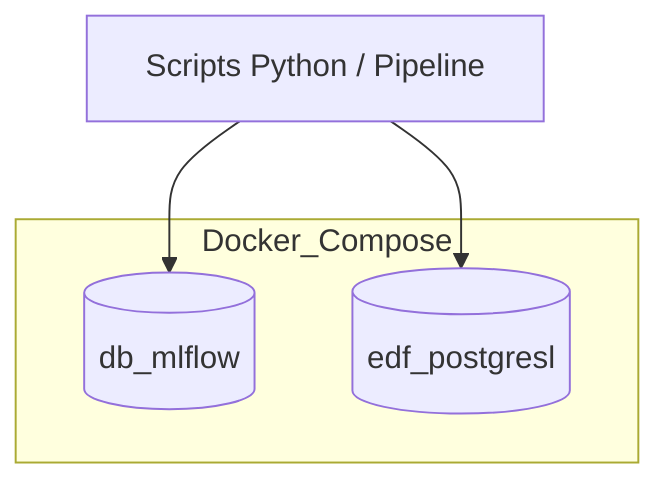

# Base de données PostgreSQL

## Résumé
Le projet utilise deux instances distinctes de PostgreSQL gérées via Docker Compose : une base dédiée aux métadonnées et au registre de modèles **MLflow**, et une base **métier** destinée au stockage des données de consommation énergétique.

## Vue d’ensemble

L'architecture s'appuie sur la conteneurisation pour isoler le stockage des données. Le service `db_mlflow` sert de backend pour le suivi des expérimentations, tandis que le service `edf_postgresl` est utilisé pour la persistance des données manipulées par les scripts Python du projet.

## Schéma

## Détails

### Service `db_mlflow`
*   **Rôle** : Supporte le serveur MLflow pour le suivi des runs et l'enregistrement des modèles.
*   **Volume** : Les données sont persistées localement pour éviter la perte des métadonnées lors de l'arrêt des conteneurs.
*   **Accès** : Utilisé principalement par le service `mlflow` défini dans le `docker-compose.yml`.

### Service `edf_postgresl`
*   **Rôle** : Stockage des données métier (données RTE/eCO2mix).
*   **Interaction** : Le script `src/db/ingestion_pg.py` contient la logique permettant d'injecter les données traitées dans cette base.
*   **Port d'exposition** : Le port `5441` sur l'hôte est mappé au port `5432` du conteneur.

:::info
La connexion à la base de données métier est configurée via des variables d'environnement. Veillez à ce que le fichier `.env` soit correctement rempli avant le lancement des services.
:::

## Tableau de synthèse

| Service | Rôle | Port Interne | Port Hôte | Usage |
| :--- | :--- | :--- | :--- | :--- |
| `db_mlflow` | Backend MLflow | 5432 | Non exposé | Tracking/Registry |
| `edf_postgresl` | Stockage Métier | 5432 | 5441 | Ingestion données |

## Points d’attention

*   **Persistance** : Bien que les volumes soient configurés, une suppression forcée des conteneurs avec les volumes (`docker-compose down -v`) effacera toutes les données.
*   **Sécurité** : Le code source contient des références aux identifiants de base de données. Ne jamais commiter ces informations dans un dépôt distant.
*   **Connexion** : Assurez-vous que le service `edf_postgresl` est pleinement opérationnel avant d'exécuter `src/db/ingestion_pg.py` pour éviter des erreurs de connexion.

## À vérifier manuellement

*   Vérifier si le schéma des tables dans `edf_postgresl` est auto-généré par les scripts ou s'il doit être initialisé manuellement via un fichier SQL de dump.
*   Confirmer la méthode d'authentification configurée dans le fichier `docker-compose.yml` (e.g., `POSTGRES_USER` et `POSTGRES_PASSWORD`).

## Sources utilisées

*   `docker-compose.yml` (Définition des services et mappage de ports).
*   `src/db/ingestion_pg.py` (Logique d'interaction avec la base métier).