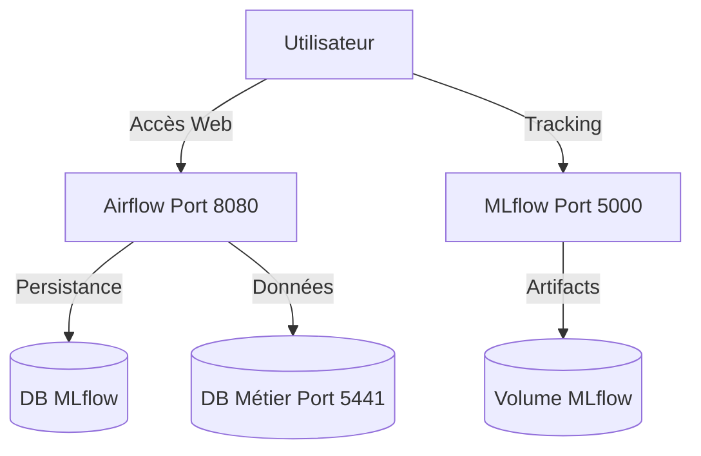

# Déploiement

## Résumé
Le déploiement de la solution EDF-MSPR3 repose sur l'orchestration de conteneurs Docker via `docker-compose`. Ce système automatise l'infrastructure nécessaire au cycle de vie MLOps : orchestration (Airflow), suivi de modèles (MLflow) et persistance des données (PostgreSQL).

## Vue d’ensemble

L'architecture est composée de services conteneurisés isolés communiquant via un réseau Docker interne. Le déploiement nécessite la mise en place de variables d'environnement pour configurer l'accès aux bases de données et aux services de tracking.

## Schéma

## Détails

### Prérequis techniques
*   **Docker & Docker Compose** : Doivent être installés sur la machine hôte.
*   **Système de fichiers** : Les dossiers de volumes (`mlflow`, `dbs_mlflow`, etc.) doivent avoir les permissions en écriture adéquates.

:::tip
Si vous rencontrez des erreurs de permission lors du lancement de MLflow, exécutez `chmod -R 777 mlflow` pour permettre au conteneur d'écrire les artefacts.
:::

### Commandes de gestion
Les opérations de maintenance courantes sont effectuées via `docker-compose` :

| Action | Commande |
| :--- | :--- |
| Lancement complet | `docker-compose up -d` |
| Arrêt des services | `docker-compose down` |
| Consultation logs | `docker-compose logs -f [service_name]` |
| Reconstruction | `docker-compose up -d --build` |

## Tableau de synthèse

| Service | Port Hôte | Port Interne | Rôle |
| :--- | :--- | :--- | :--- |
| `airflow` | 8080 | 8080 | Orchestrateur |
| `mlflow` | 5000 | 5000 | Serveur de tracking |
| `edf_postgresl`| 5441 | 5432 | Stockage données métier |
| `db_mlflow` | - | 5432 | Stockage metadata MLflow |

:::warning
Le port 5441 est mappé sur le port 5432 du conteneur `edf_postgresl`. Veillez à ne pas avoir de service PostgreSQL local tournant déjà sur le port 5441.
:::

## Points d’attention
*   **Persistance** : Le cycle de vie des données dépend des volumes définis. Une suppression des conteneurs sans gestion des volumes entraînera une perte de données métier.
*   **Secrets** : La configuration actuelle peut contenir des informations sensibles dans le fichier `docker-compose.yml`. Ne jamais exposer ce fichier dans un dépôt public.

## À vérifier manuellement
*   La configuration réseau dans `docker-compose.yml` est-elle bien isolée des réseaux externes ?
*   Le script d'ingestion utilise-t-il les bonnes variables d'environnement pour pointer vers le port 5441 (et non 5432) ?
*   Le répertoire `dags/` est-il correctement peuplé pour permettre le lancement des tâches Airflow après le déploiement ?

## Sources utilisées
*   `docker-compose.yml` (Configuration des services, ports et volumes)
*   README du projet (Informations sur les credentials et usages)
*   Analyse du repository (Structure des dossiers `src/` et `mlflow/`)