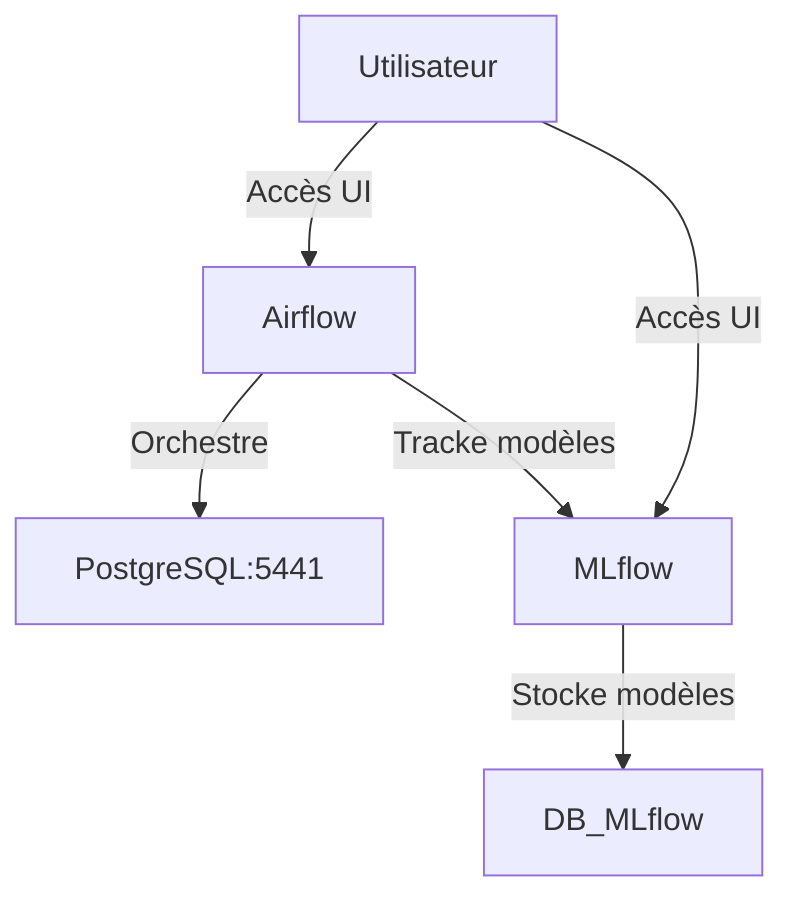

# Docker Compose

## Résumé

Le fichier `docker-compose.yml` constitue le cœur opérationnel du projet EDF-MSPR3. Il orchestre les services nécessaires à l'orchestration des pipelines (Airflow), au suivi des expériences de Machine Learning (MLflow) et au stockage des données métier (PostgreSQL).

## Vue d’ensemble

L'architecture repose sur quatre services principaux isolés dans des conteneurs distincts. La communication entre ces services est facilitée par un réseau Docker interne, tandis que l'accès aux interfaces est exposé via des ports hôtes.

## Détails

### Services principaux

*   **Airflow** : Orchestrateur central pour la gestion des pipelines de données et d'entraînement.
*   **MLflow** : Serveur de tracking permettant de versionner les modèles et d'enregistrer les métriques d'entraînement.
*   **PostgreSQL (db_mlflow)** : Backend dédié exclusivement au stockage des métadonnées MLflow.
*   **EDF_Postgresl** : Base de données relationnelle principale destinée à stocker les données de consommation énergétique traitées.

### Gestion des accès

Les services exposent les ports suivants sur la machine hôte pour permettre l'interaction :

| Service | Port Hôte | Port Interne | Rôle |
| :--- | :--- | :--- | :--- |
| Airflow | 8080 | 8080 | Interface web d'orchestration |
| MLflow | 5000 | 5000 | Interface de suivi des modèles |
| PostgreSQL (Métier) | 5441 | 5432 | Stockage des données de consommation |

:::info
Le port 5441 est utilisé pour éviter les conflits si une instance PostgreSQL est déjà active sur le port 5432 par défaut.
:::

## Tableau de synthèse

| Composant | Type | Dépendance | Usage |
| :--- | :--- | :--- | :--- |
| `docker-compose.yml` | Fichier | Docker Engine | Définition de l'infra |
| `mlflow/artifacts` | Volume | MLflow | Stockage local des artefacts |
| `dags/` | Volume | Airflow | Dossier de workflows |

## Points d’attention

*   **Persistance** : Assurez-vous que les volumes montés (`./mlflow/artifacts`, `./dags`) disposent des droits d'écriture nécessaires sur votre machine hôte.
*   **Conflits de ports** : Si l'un des ports (8080, 5000, 5441) est déjà occupé, le lancement des conteneurs échouera.
*   **Configuration** : Le fichier `docker-compose.yml` contient les variables d'environnement nécessaires à la connexion entre les services.

:::warning
Ne modifiez jamais les configurations de sécurité ou les mots de passe dans le fichier `docker-compose.yml` sans mettre à jour les fichiers `.env` associés.
:::

## À vérifier manuellement

*   Vérifier si le dossier `dags/` est correctement mappé dans `docker-compose.yml` pour refléter les changements de code en temps réel.
*   Confirmer que le service `EDF_Postgresl` est correctement initialisé avec les tables nécessaires via les scripts présents dans `src/db/`.
*   Vérifier la présence effective des fichiers de données sources dans les volumes montés avant de lancer les DAGs Airflow.

## Sources utilisées

*   `docker-compose.yml`
*   `src/db/ingestion_pg.py`
*   `README.md` (pour les conventions de nommage et ports)