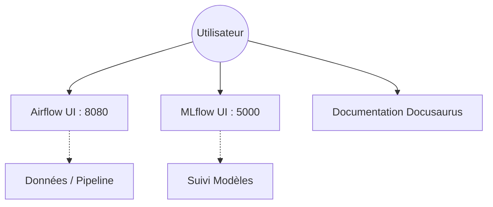

# Frontend

## Résumé

Le projet **EDF-MSPR3** ne dispose pas d'une interface graphique (Frontend) dédiée à l'utilisateur final. L'interaction avec le système se fait exclusivement via des interfaces techniques intégrées aux services MLOps et à la documentation du projet.

## Vue d’ensemble

Il n'existe aucune application web personnalisée (React, Vue, etc.) dans ce repository. Le projet se concentre sur le traitement de données, l'entraînement de modèles et l'orchestration. Les besoins d'interface sont couverts par les outils standard de la stack MLOps déployée via Docker.

## Schéma

Le schéma ci-dessous illustre l'accès aux interfaces disponibles :

## Détails

### Interfaces techniques disponibles
* **Airflow UI** : Permet de visualiser, déclencher et monitorer les DAGs (orchestration des pipelines de données et d'entraînement).
* **MLflow UI** : Interface permettant de consulter les expérimentations, les métriques de performance des modèles et le registre de modèles.
* **Documentation Docusaurus** : Fournit une interface statique pour comprendre l'architecture, les scripts et les procédures de maintenance du projet.

:::info
Bien qu'aucune interface métier n'existe, l'ensemble des services est accessible via les ports exposés dans le fichier `docker-compose.yml`.
:::

## Tableau de synthèse

| Interface | Rôle | Port | Type |
| :--- | :--- | :--- | :--- |
| **Airflow UI** | Supervision des jobs | 8080 | Service Conteneurisé |
| **MLflow UI** | Tracking MLOps | 5000 | Service Conteneurisé |
| **Docusaurus** | Documentation technique | N/A | Statique / Généré |

## Points d’attention

* **Absence d'interface métier** : Aucun écran n'est prévu pour la visualisation des prédictions de consommation énergétique par un utilisateur final.
* **Sécurité** : Les interfaces Airflow et MLflow ne semblent pas présenter de couches d'authentification complexes dans la configuration `docker-compose.yml` fournie (à vérifier selon l'environnement de déploiement).

## À vérifier manuellement

* Vérifier si un dossier `frontend` ou `web` est présent dans des branches non analysées du repository.
* Confirmer si le port 8080 d'Airflow nécessite une configuration d'accès spécifique (RBAC).
* Valider si des variables d'environnement dans `docker-compose.yml` restreignent l'accès aux interfaces aux seules machines locales (localhost).

## Sources utilisées

* `docker-compose.yml` : Analyse des ports exposés et des services déclarés.
* `README.md` : Absence de mention concernant une application frontend.
* Structure du répertoire : Aucune application frontend standard (ex: `client/`, `web/`, `public/`) détectée.