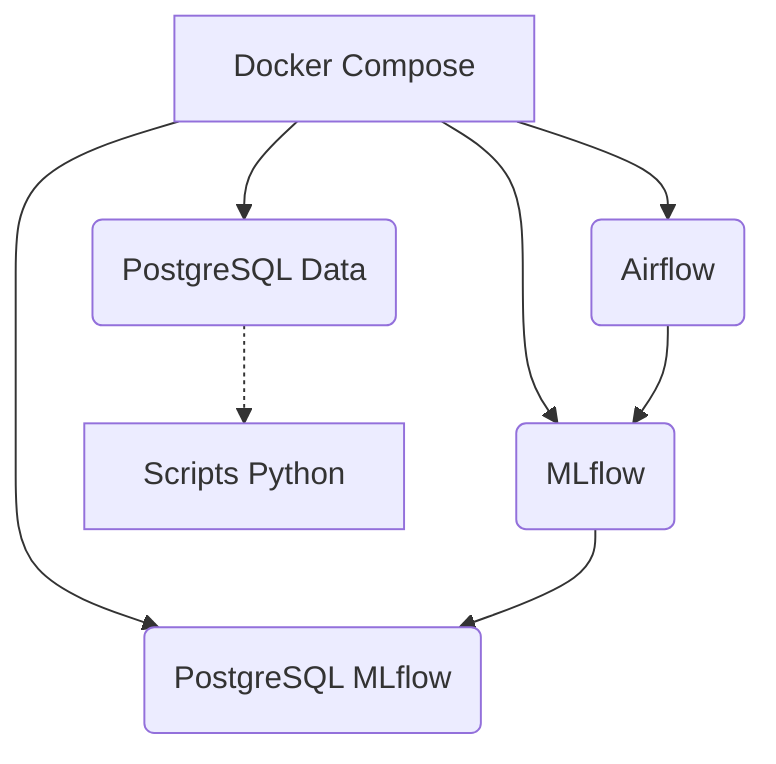

# Installation

## Résumé

Ce guide décrit la procédure pour configurer et lancer localement l'infrastructure du projet **EDF-MSPR3**. Le projet repose sur une architecture conteneurisée via Docker Compose, orchestrant Airflow, MLflow et PostgreSQL.

## Vue d’ensemble

Le lancement du projet nécessite Docker et Docker Compose. L'infrastructure est composée de quatre services principaux isolés : Airflow pour l'ordonnancement, MLflow pour le suivi des modèles et deux instances PostgreSQL pour le stockage des métadonnées et des données métier.

## Schéma

## Détails

### Prérequis
- **Docker & Docker Compose** installés sur votre machine.
- Accès aux ports 8080, 5000, 5432 et 5441.
- Espace de stockage disponible pour les volumes de données (`./mlflow/artifacts` et bases de données).

### Étapes de lancement
1. **Clonage** : Récupérez le repository sur votre machine locale.
2. **Droits d'accès** : Le README mentionne une étape nécessaire pour les permissions du dossier MLflow :
   `chmod -R 777 mlflow`
3. **Démarrage** : Lancez l'infrastructure en mode détaché :
   `docker-compose up -d`

:::tip
Utilisez `docker-compose logs -f <nom_service>` pour déboguer le lancement d'un conteneur spécifique si le démarrage semble bloqué.
:::

## Tableau de synthèse

| Action | Commande / Chemin | Description |
|---|---|---|
| Lancement | `docker-compose up -d` | Démarre tous les services en arrière-plan. |
| Arrêt | `docker-compose down` | Arrête et supprime les conteneurs. |
| Droits | `chmod -R 777 mlflow` | Correction des droits (via README). |
| Accès MLflow | `http://localhost:5000` | Interface de suivi des modèles. |
| Accès Airflow | `http://localhost:8080` | Interface d'orchestration. |

## Points d’attention

- **Conflits de ports** : Si un service PostgreSQL tourne déjà sur votre machine sur le port 5432 ou 5441, le lancement échouera.
- **Persistance** : Les données sont persistées dans les volumes locaux. La suppression des conteneurs via `down` ne supprime pas les données, mais soyez vigilant lors d'un `docker-compose down -v`.
- **Secrets** : Ne jamais exposer ou commiter de fichiers `.env` contenant des mots de passe réels.

## À vérifier manuellement

- Vérifiez que les variables d'environnement dans `docker-compose.yml` ne contiennent pas de valeurs sensibles codées en dur.
- Vérifiez la connectivité réseau entre le conteneur Python et les bases PostgreSQL après le lancement.
- Assurez-vous que les permissions du répertoire `mlflow/` sont correctement configurées pour l'utilisateur Docker.

## Sources utilisées

- `docker-compose.yml` (Analyse de la structure des services).
- `README.md` (Instructions sur les permissions et identifiants).
- `infra/start_mlflow.sh` (Scripts de démarrage).