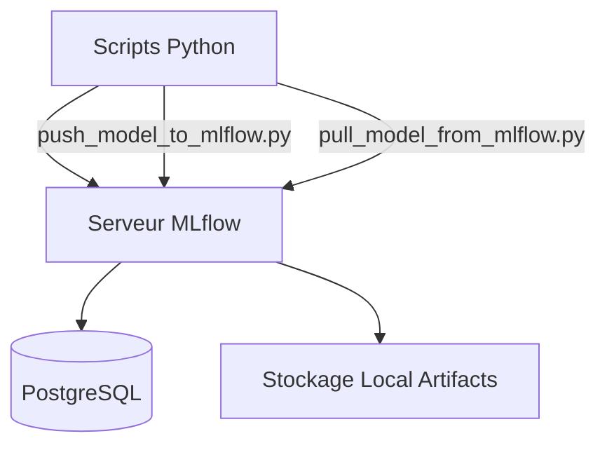

# MLflow

## Résumé
MLflow est intégré au projet pour le suivi des expérimentations et la gestion du registre de modèles. Il s'appuie sur un serveur dédié, une base de données PostgreSQL pour les métadonnées et un répertoire local pour le stockage des artefacts.

## Vue d’ensemble

Le service MLflow est déployé via `docker-compose.yml`. Il permet aux scripts d'entraînement de consigner des métriques (R2, RMSE, MAPE) et de versionner les modèles au format `joblib`.

:::info
Le serveur MLflow utilise `db_mlflow` (PostgreSQL) pour stocker les métadonnées de suivi des runs et le backend des expériences.
:::

## Schéma

Le diagramme ci-dessous illustre le flux d'interaction entre les scripts de modélisation et le serveur MLflow :

## Détails

### Services et infrastructure
- **Serveur MLflow** : Accessible sur le port `5000`.
- **Backend Store** : Base de données `db_mlflow` (PostgreSQL) dédiée au tracking.
- **Artifact Store** : Stockage local dans le répertoire `./mlflow/artifacts/` défini par les volumes Docker.

### Interaction avec les modèles
- **Push** : Le script `src/mlflow/push_model_to_mlflow.py` automatise l'enregistrement du modèle dans le registre MLflow sous le nom `MODEL_EDF`.
- **Pull** : Le script `src/mlflow/pull_model_from_mlflow.py` permet de récupérer un modèle spécifique depuis le registre pour une utilisation en inférence.
- **Format** : Les modèles sont sérialisés via la bibliothèque `joblib`.

## Tableau de synthèse

| Composant | Rôle | Emplacement / Valeur |
| :--- | :--- | :--- |
| Service Docker | Serveur MLflow | `mlflow` |
| Port Host | Accès interface | 5000 |
| Backend DB | Métadonnées | `db_mlflow` (PostgreSQL) |
| Artifacts | Fichiers modèles | `./mlflow/artifacts/` |
| Nom Registre | Identifiant modèle | `MODEL_EDF` |

## Points d’attention

- **Persistance** : Les artefacts sont stockés sur le volume local `./mlflow/artifacts/`. Assurez-vous que les droits d'accès sont correctement configurés (`chmod -R 777 mlflow` est parfois requis selon votre environnement).
- **Consistance** : Vérifiez que les noms utilisés dans les scripts (ex: `MODEL_EDF`) correspondent bien à ceux attendus par vos pipelines d'inférence.

## À vérifier manuellement

- Vérifier si la version de MLflow utilisée est compatible avec les bibliothèques de machine learning présentes dans `requirements.txt`.
- S'assurer que le volume `./mlflow/artifacts/` est bien créé sur l'hôte avant le lancement du service Docker pour éviter des erreurs de permission.
- Confirmer que l'interface Web sur le port 5000 est accessible une fois le conteneur lancé.

## Sources utilisées

- `docker-compose.yml`
- `src/mlflow/push_model_to_mlflow.py`
- `src/mlflow/pull_model_from_mlflow.py`
- `infra/start_mlflow.sh`