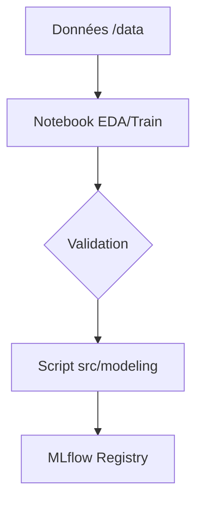

# Notebooks

## Résumé
Cette page recense les notebooks présents dans le repository **EDF-MSPR3**. Ils servent principalement à l'exploration des données, au prototypage des modèles de machine learning et à la validation des performances avant leur industrialisation dans les scripts `src/`.

:::info
À ce jour, aucun fichier `.ipynb` n'a été détecté dans l'inventaire actuel du repository. Cette documentation reste une structure d'accueil pour le jour où des notebooks seront ajoutés au projet.
:::

## Vue d’ensemble

Les notebooks constituent l'interface de travail privilégiée des Data Scientists pour :

*   **Exploration (EDA) :** Visualiser la corrélation entre les données météorologiques et la consommation énergétique.
*   **Expérimentation :** Tester différents algorithmes (RandomForest, KNN, LinearRegression) sur les jeux de données locaux.
*   **Analyse :** Évaluer la précision des modèles avant leur déploiement via MLflow.

## Schéma

Le flux de travail typique pour un notebook dans ce projet suit généralement cette logique de développement :

## Détails

### Rôles des notebooks
*   **Exploration :** Analyse des fichiers `.xls` et `.csv` situés dans le dossier `/data`.
*   **Prototypage :** Utilisation des bibliothèques (`scikit-learn`, `pandas`) pour valider les étapes présentes dans `src/modeling/`.
*   **Test :** Vérification de la connexion aux bases de données (`edf_postgresl`) pour s'assurer de la cohérence des features extraites.

## Tableau de synthèse

| Nom du fichier | Rôle (Prévisionnel) | Statut |
| :--- | :--- | :--- |
| `notebooks/eda.ipynb` | Analyse exploratoire des données | Absent |
| `notebooks/train_prototype.ipynb` | Test des modèles de ML | Absent |
| `notebooks/validation.ipynb` | Tests de performance | Absent |

## Points d’attention

*   **Gestion des secrets :** Ne jamais inclure de chaînes de connexion codées en dur (ex: identifiants PostgreSQL) dans les notebooks. Utilisez des variables d'environnement.
*   **Sync avec le code :** Les notebooks doivent rester des outils de recherche. Les fonctions stables doivent être migrées vers le dossier `src/` pour être intégrées aux pipelines Airflow.
*   **Données :** Les fichiers dans `/data` ne doivent pas être commités s'ils sont trop volumineux (utiliser `.gitignore`).

## À vérifier manuellement

*   Vérifier si des notebooks sont présents dans des dossiers ignorés par le Git.
*   S'assurer que les dépendances (versions de `pandas`, `scikit-learn`) sont identiques entre le `requirements.txt` et l'environnement d'exécution du notebook.
*   Confirmer si les notebooks utilisent les mêmes chemins de données que les scripts de production.

## Sources utilisées

*   Inventaire du repository `EDF-MSPR3`.
*   Analyse de la structure des dossiers `src/` et `/data`.
*   Fichier `README.md` (pour le contexte global du projet).