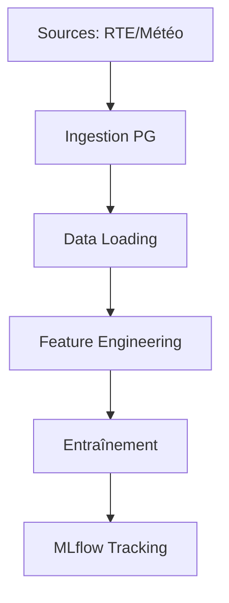

# Pipelines de traitement

## Résumé

Le projet EDF-MSPR3 automatise le cycle de vie des données énergétiques, de l'ingestion à l'enregistrement de modèles. Le pipeline repose sur l'ingestion de sources externes (RTE, Open-Meteo), le traitement via des scripts Python, et le suivi des performances sous MLflow.

## Vue d’ensemble

Le workflow technique se décompose en trois phases majeures :
1. **Ingestion & Stockage** : Collecte des données brutes et persistance en base PostgreSQL.
2. **Feature Engineering & Modélisation** : Préparation des données et entraînement des modèles.
3. **Tracking & Registry** : Enregistrement des artifacts de modélisation dans MLflow.

## Schéma

## Détails

### Ingestion des données
La récupération des données est pilotée par des scripts dédiés. Le fichier `src/data/weather_loader.py` interroge l'API Open-Meteo. Les données sont ensuite structurées et insérées dans la table `meteo_all_cities` via le script `src/db/ingestion_pg.py`.

### Traitement et Modélisation
Le pipeline de transformation s'appuie sur `src/data/data_loader.py` et `src/features/features.py`. L'entraînement, effectué dans `src/main.py`, utilise des algorithmes de Scikit-learn (RandomForest, KNN, LinearRegression). La sérialisation semble réalisée via `joblib` (déduit du contexte MLOps habituel).

### Tracking MLflow
Une fois le modèle entraîné, le script `src/mlflow/push_model_to_mlflow.py` assure la liaison avec le serveur MLflow. Le modèle est enregistré sous le nom `MODEL_EDF` pour permettre son versioning et son déploiement futur.

## Tableau de synthèse

| Étape | Script / Composant | Responsabilité |
| :--- | :--- | :--- |
| Ingestion | `weather_loader.py` | Appel API Open-Meteo |
| Stockage | `ingestion_pg.py` | Écriture table `meteo_all_cities` |
| Préparation | `features.py` | Feature engineering |
| Entraînement | `src/main.py` | Modélisation ML |
| Tracking | `push_model_to_mlflow.py` | Enregistrement modèle (MLflow) |

:::info
Le répertoire `./dags` est monté dans le conteneur Airflow, mais aucun fichier `.py` de DAG n'est présent dans le repository actuel pour orchestrer ces étapes automatiquement.
:::

## Points d’attention

*   **Dépendance API** : L'ingestion dépend de la disponibilité des services externes (RTE, Open-Meteo).
*   **Orchestration** : Bien que l'infrastructure Airflow soit configurée dans `docker-compose.yml`, les pipelines ne sont pas encore automatisés via des DAGs dans le code source fourni.
*   **Volumétrie** : La persistance des données dépend de la bonne santé du volume Docker `postgresql_data`.

## À vérifier manuellement

*   Vérifier si le script `src/main.py` inclut une logique d'évaluation automatique avant le `push` vers MLflow.
*   Confirmer si le format des fichiers dans `./data/` correspond bien aux attentes des scripts de chargement.
*   Valider l'existence effective des dépendances `joblib` dans le fichier `requirements.txt`.

## Sources utilisées

*   `docker-compose.yml`
*   `src/data/weather_loader.py`
*   `src/db/ingestion_pg.py`
*   `src/mlflow/push_model_to_mlflow.py`
*   `src/main.py`