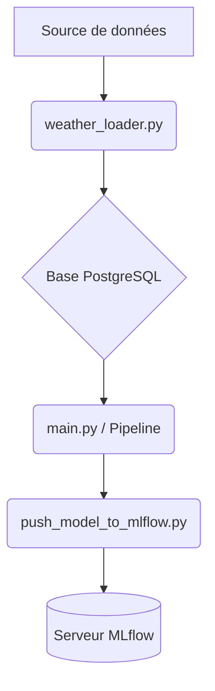

# Scripts Python

## Résumé
Le projet repose sur une série de scripts Python situés dans le répertoire `src/`, orchestrant le cycle de vie des données : de l'ingestion via des APIs externes au stockage en base de données, jusqu'à la gestion du cycle de vie des modèles dans MLflow.

## Vue d’ensemble

Les scripts sont segmentés par domaine fonctionnel. Ils permettent de transformer des données brutes (météo, consommation) en modèles exploitables, puis de les versionner.

*   **Data Ingestion** : Récupération et nettoyage.
*   **Database Management** : Interaction avec PostgreSQL.
*   **MLOps** : Tracking et registre de modèles avec MLflow.

## Schéma

## Détails

### Ingestion et Persistance
*   `src/data/weather_loader.py` : Responsable de la connexion à l'API Open-Meteo pour récupérer les données météorologiques.
*   `src/db/ingestion_pg.py` : Gère le transfert des données nettoyées vers la table `meteo_all_cities` de la base `edf_postgresl`.

### Modélisation et MLOps
*   `src/main.py` : Script central exécutant le pipeline d'entraînement (RandomForest, KNN, LinearRegression).
*   `src/mlflow/push_model_to_mlflow.py` : Enregistre le modèle entraîné dans le registre MLflow sous le nom `MODEL_EDF`.
*   `src/mlflow/pull_model_from_mlflow.py` : Récupère une version spécifique d'un modèle depuis le registre.

## Tableau de synthèse

| Script | Rôle | Dépendance principale |
| :--- | :--- | :--- |
| `weather_loader.py` | Ingestion Météo | `requests` |
| `ingestion_pg.py` | ETL PostgreSQL | `psycopg2` / `sqlalchemy` |
| `main.py` | Pipeline ML | `scikit-learn`, `pandas` |
| `push_model_to_mlflow.py` | Registry MLflow | `mlflow`, `joblib` |

:::tip
Assurez-vous que les variables d'environnement nécessaires à la connexion aux bases de données sont configurées avant de lancer ces scripts manuellement.
:::

## Points d’attention

*   **Séquencement** : Le script `main.py` suppose que les données sont déjà présentes en base de données.
*   **Format** : Les scripts attendent des structures de données spécifiques qui pourraient varier selon les fichiers sources présents dans `./data/`.
*   **Sécurité** : Ne jamais modifier les scripts pour y inclure des identifiants de connexion en dur.

## À vérifier manuellement

*   Vérifier si des arguments CLI sont nécessaires pour `main.py` (ex: sélection du modèle ou date de dataset).
*   Confirmer si le répertoire `dags/` contient des fichiers `python` qui appellent ces scripts, comme déduit par la configuration Docker.
*   Vérifier l'existence et la validité des fichiers dans le dossier local `/data` avant exécution.

## Sources utilisées

*   `src/data/weather_loader.py`
*   `src/mlflow/push_model_to_mlflow.py`
*   `src/mlflow/pull_model_from_mlflow.py`
*   `src/db/ingestion_pg.py`
*   `src/main.py`
*   `docker-compose.yml` (pour la configuration des services liés)