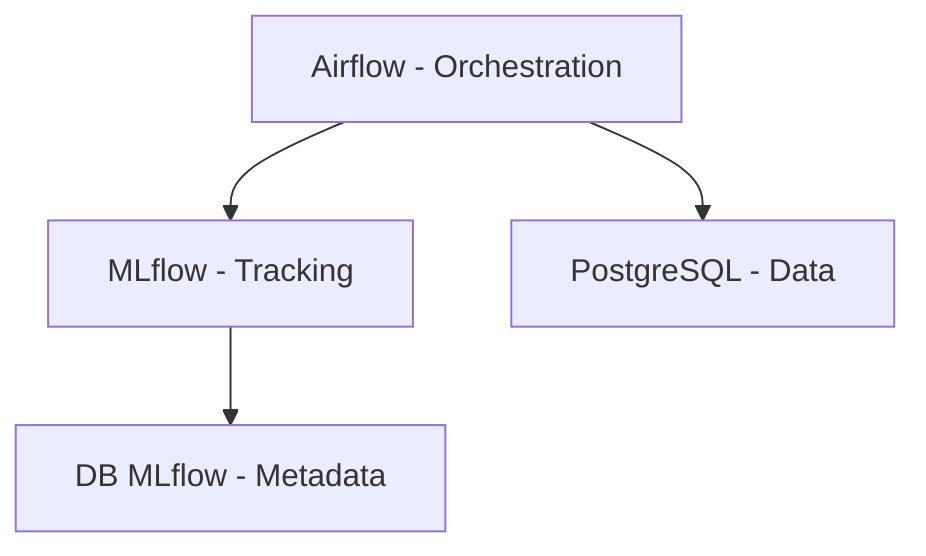

# Services

## Résumé

Le projet repose sur une architecture conteneurisée orchestrée par Docker Compose. Elle permet de gérer le cycle de vie du Machine Learning, de l'ingestion des données à l'enregistrement des modèles, en s'appuyant sur Airflow pour l'ordonnancement, MLflow pour le versioning et PostgreSQL pour la persistance des données.

## Vue d’ensemble

L'infrastructure est composée de quatre services principaux isolés via Docker. Chaque service possède son propre rôle, garantissant une séparation nette entre l'orchestration, le stockage des données métier et le suivi des modèles.

## Schéma

## Détails

### Airflow
Service central d'orchestration. Il est responsable de l'exécution des DAGs (Data pipelines).
*   **Rôle** : Automatisation de l'ingestion et des entraînements.
*   **Port** : `8080`.
*   **Statut** : Confirmé par `docker-compose.yml`.

### MLflow
Serveur dédié au suivi des expérimentations et au registre des modèles.
*   **Rôle** : Stockage des métriques et artifacts de modèles.
*   **Port** : `5000`.
*   **Statut** : Confirmé par `docker-compose.yml`.

### Bases de données
Le projet utilise deux instances PostgreSQL distinctes :
*   **`db_mlflow`** : Stockage interne des métadonnées MLflow.
*   **`edf_postgresl`** : Stockage des données métier (ex: `meteo_all_cities`). Port local : `5441`.

## Tableau de synthèse

| Service | Image/Composant | Port Host:Container | Persistance |
| :--- | :--- | :--- | :--- |
| `airflow` | Airflow | 8080:8080 | `airflowdata` |
| `mlflow` | MLflow Server | 5000:5000 | `./mlflow` (local) |
| `db_mlflow` | Postgres | - | `dbs_mlflow` |
| `edf_postgresl`| Postgres | 5441:5432 | `postgresql_data` |

:::tip
Utilisez `docker-compose up -d` pour démarrer l'ensemble des services en arrière-plan après avoir configuré votre environnement.
:::

## Points d’attention

*   **Permissions** : Les artifacts MLflow sont stockés dans un dossier local (`mlflow/`). Assurez-vous que les droits d'écriture sont corrects (`chmod -R 777 mlflow`).
*   **Isolation** : Bien que deux bases de données soient présentes, leur configuration réseau dans le fichier `docker-compose.yml` doit être respectée pour éviter les conflits de ports.
*   **Dépendances** : Les scripts Python (`src/`) dépendent fortement des bibliothèques listées dans `requirements.txt`.

## À vérifier manuellement

*   Vérifier la présence et le contenu effectif du dossier `dags/`, car aucun fichier DAG n'a été détecté dans l'analyse actuelle malgré la configuration Airflow.
*   Valider la connectivité réseau entre le service Airflow et la base de données `edf_postgresl` pour l'exécution des scripts d'ingestion.
*   Vérifier si des variables d'environnement critiques (non listées dans les fichiers fournis) sont nécessaires pour la connexion à l'API Open-Meteo.

## Sources utilisées

*   `docker-compose.yml`
*   `requirements.txt`
*   `src/mlflow/push_model_to_mlflow.py`
*   `infra/start_mlflow.sh`