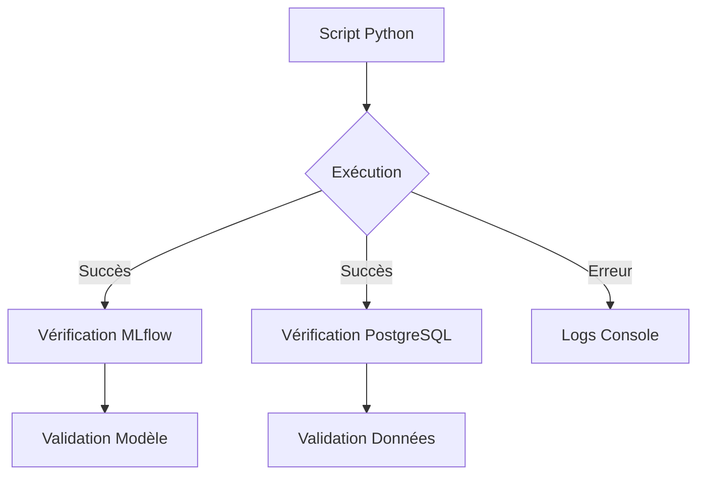

# Tests

## Résumé

Le repository **EDF-MSPR3** ne contient actuellement aucun framework de tests automatisés (ex: `pytest`, `unittest`). La validation du code repose sur l'exécution manuelle des scripts de pipelines et la vérification visuelle des sorties dans MLflow ou la base de données.

## Vue d’ensemble

Les processus de validation sont intégrés directement dans les scripts d'exécution. Chaque module (ingestion, entraînement, tracking) est conçu pour être lancé de manière isolée via des scripts Python. Il n'existe pas de suite de tests unitaires ou d'intégration structurée.

## Schéma

Le schéma ci-dessous illustre le flux actuel de validation manuelle utilisé par les développeurs pour vérifier la conformité du pipeline.

## Détails

### Absence de tests automatisés
Aucun répertoire `tests/` n'a été détecté dans la structure du projet. Les fichiers `requirements.txt` ne mentionnent aucune dépendance liée aux tests (ex: `pytest`, `pytest-cov`, `mock`).

### Validation par exécution
La "qualité" est garantie par le comportement des scripts principaux :
- **Ingestion** : La vérification se fait par la présence de données dans les tables PostgreSQL.
- **Entraînement** : La validation repose sur l'affichage des métriques dans la console et la création d'entrées dans le serveur MLflow.

:::warning
En l'absence de tests unitaires, toute modification du code source nécessite une exécution complète du pipeline pour vérifier les régressions.
:::

## Tableau de synthèse

| Composant | Méthode de validation | État |
|---|---|---|
| Tests unitaires | Aucun framework détecté | Absent |
| Tests d'intégration | Exécution manuelle des scripts | Partiel |
| Validation MLflow | Vérification via interface Web | Manuel |
| Validation DB | Requêtes SQL directes | Manuel |

## Points d’attention

- **Risque de régression** : Le manque de tests automatisés augmente le risque d'introduire des bugs lors de l'évolution des scripts de traitement.
- **Dépendance environnementale** : La validation nécessite que l'infrastructure Docker soit totalement opérationnelle, ce qui rend les tests lourds à exécuter.

## À vérifier manuellement

- Vérifier si des scripts de test sont cachés dans des dossiers non standards.
- Confirmer la présence de fichiers de test générés par les IDE ou outils de profiling.
- Valider manuellement le comportement du script `src/main.py` suite à toute modification mineure.

## Sources utilisées

- Analyse de l'arborescence du repository.
- Examen des fichiers `requirements.txt`.
- Revue des scripts contenus dans `src/`.