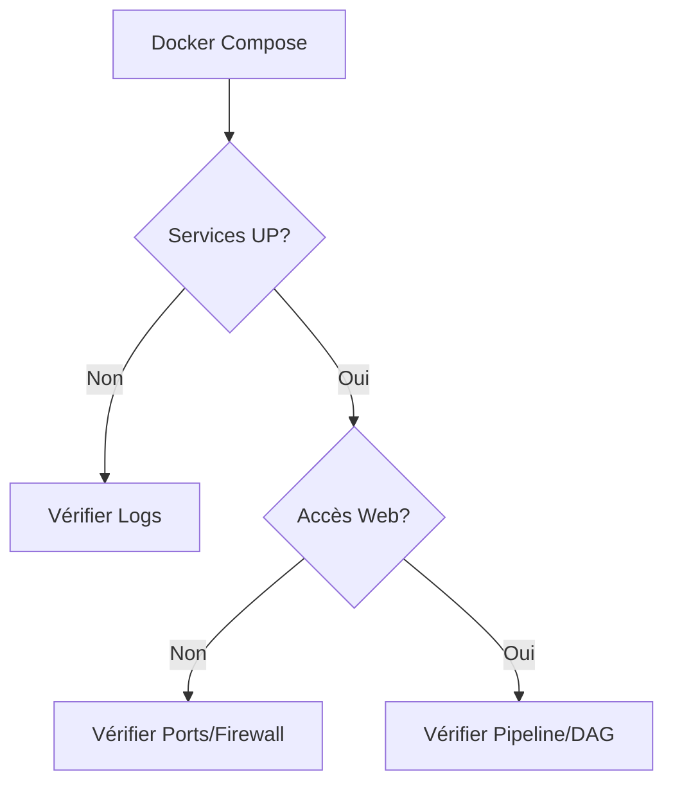

# Troubleshooting

## Résumé
Cette page recense les erreurs courantes rencontrées lors de l'exécution de l'infrastructure MLOps du projet EDF-MSPR3. Elle aide au diagnostic des services Docker, de la connectivité aux bases de données et des flux MLflow/Airflow.

## Vue d’ensemble

Les problèmes techniques se situent principalement au niveau de la persistance des volumes Docker, de la connectivité réseau entre les conteneurs et de l'initialisation des services.

:::tip
Commencez toujours par vérifier le statut des conteneurs avec `docker ps` avant toute investigation approfondie.
:::

## Schéma

## Détails

### Erreurs de services Docker
- **Erreurs de permissions :** Si `mlflow` ou `postgresql` échouent au démarrage, vérifiez les droits en écriture sur les dossiers montés localement.
- **Conflits de ports :** Le port `5441` est mappé pour PostgreSQL. Si une erreur "Port already in use" survient, vérifiez si une autre instance locale de Postgres tourne sur votre machine.

### Connectivité Base de Données
- **Timeout de connexion :** Assurez-vous que le nom du service (`db_mlflow` ou `edf_postgresl`) est utilisé comme hôte dans les scripts Python, et non `localhost` (sauf si lancé hors conteneur).
- **Service non prêt :** Airflow peut échouer si la base de données n'est pas totalement initialisée.

### MLflow
- **Artefacts absents :** Si le tracking échoue, vérifiez que le dossier `mlflow/` existe à la racine et possède les droits de lecture/écriture (`chmod -R 777 mlflow`).

## Tableau de synthèse

| Symptôme | Cause probable | Action corrective |
| :--- | :--- | :--- |
| `Connection refused` | Service non démarré | `docker-compose up -d` |
| `Permission denied` | Droits sur les volumes | `chmod -R 777 <dossier>` |
| `ModuleNotFoundError` | Dépendances manquantes | Vérifier `requirements.txt` |
| `Port already in use` | Conflit local | Stopper le processus local ou changer le port |

## Points d’attention

- **Secrets :** Ne jamais commiter de fichiers `.env` contenant des mots de passe en clair dans le repository.
- **Persistance :** La suppression des conteneurs sans gestion prudente des volumes (`docker-compose down -v`) effacera vos données et modèles enregistrés.
- **Logs :** Utilisez `docker-compose logs -f <service>` pour isoler l'origine d'un crash.

## À vérifier manuellement

- Vérifier que les variables d'environnement dans le `docker-compose.yml` correspondent bien aux attentes des scripts Python.
- Vérifier la présence physique des dossiers de volumes sur l'hôte avant le premier `docker-compose up`.
- Tester la connectivité vers l'API Open-Météo depuis le conteneur pour s'assurer que les restrictions réseau (proxy/firewall) ne bloquent pas l'ingestion.

## Sources utilisées

- `docker-compose.yml` (Configuration des services et volumes)
- `README.md` (Informations sur les credentials et usages)
- Scripts de la branche `src/` (Dépendances et accès base de données)